# GoClaw 技术架构文档

本文档基于当前仓库代码整理，面向研发接手、架构评审和后续演进规划。更细的专题设计可继续参见 `docs/00-architecture-overview.md`、`docs/18-http-api.md`、`docs/19-websocket-rpc.md`、`docs/23-multi-tenant-architecture.md` 和 `docs/24-knowledge-vault.md`。

## 1. 项目定位

GoClaw 是一个 Go 实现的多租户 AI Agent Gateway。它把 LLM Provider、Agent 运行循环、工具执行、消息渠道、团队任务、记忆系统、知识库、Web/桌面 UI 和运维能力组织成一个可单二进制部署的服务。

核心目标：

- 对外提供 WebSocket RPC v3、OpenAI-compatible HTTP API 和 Web Dashboard。
- 对内统一 Agent、Provider、Tool、Store、Channel、Scheduler、Hook、Tracing 等运行时组件。
- 支持 Standard 服务端版和 Lite 桌面版：Standard 默认 PostgreSQL/pgvector，Lite 使用 SQLite + Wails。
- 通过租户上下文、权限引擎、加密凭据、工具策略、SSRF 防护和审计日志控制多用户/多渠道风险。

## 2. 技术栈

| 层级 | 技术 |
| --- | --- |
| 后端语言 | Go 1.26 |
| CLI | Cobra |
| HTTP/WS | `net/http`、`gorilla/websocket` |
| 存储 | PostgreSQL 18 + pgvector；Lite/桌面版使用 SQLite |
| DB 访问 | 原生 SQL、`database/sql`、`pgx/v5`、`sqlx` 辅助 |
| 前端 | React 19、TypeScript 6、Vite 8、Tailwind CSS 4、Radix UI、Zustand、TanStack Query |
| 桌面版 | Wails v2 + React + SQLite |
| LLM 接入 | Anthropic、OpenAI-compatible、DashScope、Codex、Claude CLI、ACP、OpenRouter/Gemini/DeepSeek 等兼容端点 |
| 工具/扩展 | MCP bridge、Skills runtime、Docker sandbox、Browser automation、TTS/STT、Knowledge Vault |
| 可观测性 | 内置 LLM tracing，按构建标签可启用 OpenTelemetry OTLP |
| 部署 | 单 Go binary、`deploy/docker/Dockerfile`、`deploy/compose/`，可选 Redis、Browser、Sandbox、Tailscale、Jaeger |

## 3. 仓库结构

| 路径 | 职责 |
| --- | --- |
| `main.go` | 程序入口，调用 `cmd.Execute()` |
| `cmd/` | Cobra CLI、网关启动编排、迁移、备份、恢复、onboard、provider/channel/skill 管理 |
| `internal/gateway/` | WebSocket server、HTTP mux、RPC router、client 管理、rate limit、事件广播 |
| `internal/gateway/methods/` | WebSocket RPC 方法实现：chat、agents、teams、sessions、skills、cron、hooks、tenants 等 |
| `internal/http/` | REST/SSE/OpenAI-compatible HTTP handlers：`/v1/chat/completions`、`/v1/responses`、agents、skills、vault、tts、backup 等 |
| `internal/agent/` | Agent Router、Agent Loop、系统提示词构建、上下文裁剪、工具调用、媒体、记忆、演化建议 |
| `internal/pipeline/` | Agent run 的阶段化执行框架 |
| `internal/providers/` | Provider Registry、模型解析、Anthropic/OpenAI-compatible/Codex/Claude CLI/ACP 等 provider |
| `internal/tools/` | Tool Registry、文件/命令/web/memory/vault/mcp/subagent/team/media/tts 等工具 |
| `internal/store/` | Store interfaces、租户上下文、作用域模型、PG/SQLite 双实现 |
| `internal/channels/` | Telegram、Discord、Slack、Feishu/Lark、Zalo、WhatsApp、Facebook/Pancake 等渠道适配 |
| `internal/memory/` | 记忆检索、embedding、自动注入 |
| `internal/vault/` | Knowledge Vault 文档、wikilink、hybrid search、异步 enrichment |
| `internal/hooks/` | Agent 生命周期 hooks、命令/HTTP handler、安全预算和审计 |
| `internal/scheduler/` | lane-based 调度，隔离主会话、subagent、cron、team 等执行流 |
| `internal/tracing/` | LLM trace/span 收集、快照和可选 OTLP export |
| `pkg/protocol/` | 可被外部 client 复用的 WebSocket v3 协议类型与方法常量 |
| `pkg/browser/` | Browser automation tool 公共包 |
| `migrations/` | PostgreSQL schema migrations |
| `ui/web/` | Web Dashboard |
| `ui/desktop/` | Wails 桌面版 |
| `skills/` | 内置 Office/PDF 等技能包 |
| `tests/` | contracts、invariants、integration、scenarios 等测试层 |

## 4. 总体组件关系

```mermaid
flowchart TD
    CLI[Cobra CLI] --> GW[Gateway Bootstrap]
    Web[React Web UI] --> HTTP[HTTP API]
    SDK[WS/HTTP Clients] --> WS[WebSocket RPC v3]
    Channels[Messaging Channels] --> Bus[Message Bus]

    GW --> Server[Gateway Server]
    Server --> HTTP
    Server --> WS
    Server --> Router[Method Router]
    Router --> Perm[Permission / Rate Limit]
    HTTP --> Perm
    Perm --> AgentRouter[Agent Router]

    AgentRouter --> Pipeline[Agent Pipeline]
    Pipeline --> Providers[Provider Registry]
    Pipeline --> Tools[Tool Registry]
    Pipeline --> Stores[Store Layer]
    Tools --> Stores
    Tools --> MCP[MCP / Skills / Sandbox / Browser]

    Bus --> Scheduler[Lane Scheduler]
    Scheduler --> AgentRouter
    Bus --> Channels

    Stores --> PG[(PostgreSQL + pgvector)]
    Stores --> SQLite[(SQLite Lite)]
    Stores --> Files[Workspace / Skills / Media Files]

    EventBus[Domain Event Bus] --> Consolidation[Memory Consolidation]
    EventBus --> VaultEnrich[Vault Enrichment]
    Consolidation --> Stores
    VaultEnrich --> Stores
```



## 5. 启动链路

主入口很薄：

```text
main.go -> cmd.Execute() -> rootCmd.Run -> runGateway()
```

`runGateway()` 是主要 composition root，启动时按以下顺序组装系统：

1. 初始化 `slog` 和配置：读取 `config.json`/`GOCLAW_CONFIG`，再叠加环境变量。
2. 判断 edition：`GOCLAW_EDITION` 可显式指定；SQLite backend 默认进入 Lite edition。
3. 创建 `MessageBus` 和 `DomainEventBus`。
4. 创建 Provider model registry，并注册 Anthropic/OpenAI forward-compatible model resolver。
5. 注册 Provider：配置文件和数据库 provider 都会进入 `Provider Registry`，数据库配置可覆盖静态配置。
6. 解析 workspace，并初始化工具系统：Tool Registry、执行审批、MCP manager、sandbox、browser、web fetch、TTS/audio、权限策略。
7. 初始化 Store：默认 PG；带 `sqlite`/`sqliteonly` build tag 时支持 SQLite。
8. 连接 tracing、cron snapshot、Redis 可选缓存、OpenTelemetry 可选 exporter。
9. 注册 memory consolidation 与 vault enrichment 后台 worker。
10. 加载 bootstrap files，回填历史 agent capabilities。
11. 初始化 subagent、skills loader、内置工具、context/memory/vault interceptors。
12. 创建 `agent.Router` 和 `gateway.Server`，挂载 HTTP handlers、WebSocket RPC methods、MCP bridge、embedded Web UI。
13. 加载渠道实例，启动 Channel Manager。
14. 创建 lane scheduler，启动 cron、heartbeat、消息 consumer、事件订阅和 graceful shutdown。

这个结构的好处是大部分模块仍然是可替换依赖，真正的全局编排集中在 `cmd/gateway*.go`。

## 6. 对外接口层

### 6.1 WebSocket RPC v3

协议类型在 `pkg/protocol/frames.go`：

- request frame：`type=req`、`id`、`method`、`params`
- response frame：`type=res`、`id`、`ok`、`payload` 或 `error`
- event frame：`type=event`、`event`、`payload`、`seq`、`stateVersion`

RPC 方法常量集中在 `pkg/protocol/methods.go`，覆盖：

- agent/chat/session：`chat.send`、`chat.history`、`chat.abort`、`sessions.*`
- agent 管理：`agents.*`、`agents.files.*`、`agents.links.*`
- team：`teams.*`、`teams.tasks.*`、`teams.workspace.*`
- skills/cron/channels/pairing/heartbeat/hooks/usage/quota/logs 等管理面能力。

### 6.2 HTTP API

HTTP mux 在 `internal/gateway/server.go` 构建。关键入口：

- `/health`：健康检查。
- `/v1/chat/completions`：OpenAI-compatible chat API。
- `/v1/responses`：OpenAI Responses 风格 API。
- `/v1/tools/invoke`：直接工具调用。
- `/mcp/bridge`：把 GoClaw tools 暴露给本机 Claude/Codex 等 MCP client，要求 gateway token。
- 其他 `/v1/*` routes 由 `internal/http/*Handler` 注册，覆盖 agents、providers、skills、teams、vault、memory、traces、TTS、backup/restore、tenant、secure CLI 等。

### 6.3 Web 与桌面 UI

- `ui/web/` 是服务端 Web Dashboard，生产构建可复制到 `internal/webui/dist` 并通过 `embedui` build tag 嵌入 Go binary。
- `ui/desktop/` 是 Wails 桌面版，使用 `sqliteonly` build tag 和本地 SQLite。

### 6.4 消息渠道

Channel Manager 通过 `internal/channels/` 适配 Telegram、Discord、Slack、Feishu/Lark、Zalo、WhatsApp 等渠道。渠道消息进入 Message Bus，再由 consumer、scheduler 和 Agent Router 处理；Agent 输出也通过 Bus 回推到渠道。

## 7. Agent 运行时

Agent 的核心抽象是 `agent.Router` 和 pipeline。Agent 不在启动时全部实例化，而是从数据库懒加载解析，便于多租户、动态配置和 UI 管理。

当前默认 pipeline 位于 `internal/pipeline/pipeline.go`：

```text
Setup:
  ContextStage

Per iteration:
  ThinkStage
  PruneStage
  ToolStage
  ObserveStage
  CheckpointStage

Finalize:
  FinalizeStage
```

其中 `MemoryFlushStage` 作为 compaction/prune 相关辅助阶段使用。README 中描述的 8-stage agent pipeline 在代码里被收敛成这些执行 stage：上下文、历史、提示词构建等能力主要聚合在 `ContextStage` 和 `agent` 包的 helper 中；思考、工具调用、观察、记忆与总结由迭代阶段和 finalize 阶段协作完成。

Agent run 的核心数据流：

1. RPC/HTTP/channel 请求解析出 tenant、user、agent、session、workspace 等上下文。
2. Agent Router 解析目标 agent 和 provider/model。
3. ContextStage 构建运行上下文：系统提示词、历史、skills、memory、workspace、权限和工具 schema。
4. ThinkStage 调用 Provider。
5. ToolStage 根据模型 tool calls 调用 Tool Registry。
6. ObserveStage 把工具结果回填给模型上下文，必要时继续下一轮。
7. CheckpointStage 持久化中间状态。
8. FinalizeStage 落库消息、trace、media、memory flush、post-turn 任务。

## 8. Provider 层

`internal/providers/` 负责把不同模型供应商规整成统一 chat/stream/tool/image/reasoning 能力。

主要设计点：

- `Provider Registry` 支持按 tenant 获取 provider。
- Provider 配置既可来自 config，也可来自数据库；密钥由 store/config secrets 加密保存。
- Model registry 提供 forward-compatible 模型解析，避免新模型名被硬编码逻辑挡住。
- Anthropic 走 native HTTP + SSE，并支持 prompt cache 相关逻辑。
- OpenAI-compatible 路径覆盖 OpenAI、Gemini、DeepSeek、DashScope、OpenRouter 等兼容端点。
- ACP/Claude CLI/Codex 等 provider 支持本地进程或专有协议集成。
- Provider capabilities 控制 image generation、reasoning、embedding 等能力是否对 Agent 暴露。

## 9. Tool 与扩展系统

`internal/tools.Registry` 是工具执行中枢，支持：

- 工具注册、metadata、aliases、禁用开关。
- per-session rate limit。
- 输出 credential scrubbing。
- MCP deferred activation。
- 每次工具调用通过 context 注入 channel、chat、session、sandbox key 等运行信息，避免工具实例保存可变状态。

主要工具族：

- 文件与 workspace：读写、列表、media、path policy。
- Shell/exec：执行审批、deny groups、输出截断、sandbox 提示。
- Web：search/fetch、抓取策略、SSRF/隐藏内容防护。
- Memory/Vault/Knowledge Graph：记忆检索、知识库查询、wikilink/graph。
- Agent orchestration：spawn/subagent、delegate、team tasks。
- 多媒体：image/audio/video/document read/create。
- 外部扩展：MCP、skills、custom tools、publish/use skill。

## 10. 数据与多租户模型

Store 层以 `internal/store.Stores` 聚合所有领域 store。PG 和 SQLite 返回同一套接口结构，便于服务端版和 Lite 版共享上层业务逻辑。

关键点：

- PostgreSQL 实现在 `internal/store/pg/`，SQLite 实现在 `internal/store/sqlitestore/`。
- 多租户上下文通过 `store.WithTenantID`、`WithUserID`、`WithAgentID`、`WithRole` 等注入 `context.Context`。
- `ScopeFromContext` 缺少 tenant 时 fail-closed；查询通过 `QueryScope` 拼接 tenant/project 条件。
- 敏感配置、provider credentials、MCP credentials、secure CLI credentials 使用加密 store，密钥来自 `GOCLAW_ENCRYPTION_KEY`。
- Standard 版 migrations 在 `migrations/`；SQLite schema 在 `internal/store/sqlitestore/schema.go`。

主要数据域：

- agents、sessions、messages/history
- providers、api keys、config secrets、system configs
- skills、builtin tools、tenant tool/skill config
- memory、episodic summaries、knowledge graph、vault documents
- teams、team tasks、subagent tasks、agent links
- channel instances、contacts、pending messages、pairing
- tracing、activity、hooks、heartbeat、cron、snapshots

## 11. 后台任务与事件

系统使用两类事件机制：

- `internal/bus.MessageBus`：面向实时业务事件，例如渠道消息、缓存失效、WebSocket broadcast、agent/channel 事件。
- `internal/eventbus.DomainEventBus`：面向领域后台处理，例如 memory consolidation、vault enrichment。

Scheduler 使用 lane-based 并发控制，区分 main、subagent、cron、team 等执行流，避免同一 session 或租户范围内的运行互相踩踏。

后台任务包括：

- cron jobs 和 heartbeat ticker。
- memory consolidation：episodic -> semantic -> knowledge graph/dreaming。
- vault enrichment：摘要、embedding、自动链接。
- tracing snapshot worker。
- update checker。
- skills watcher。
- channel streaming/reaction forwarding。

## 12. 安全架构

主要安全控制面：

- Gateway token、API key 和租户/角色权限检查。
- `permissions.PolicyEngine` 与 config permission grant。
- WebSocket origin allowlist 和 request rate limit。
- Store 查询 fail-closed tenant scope。
- AES-256-GCM 加密 provider/API/MCP/secure CLI 等密钥。
- Tool output credential scrubbing。
- Shell deny groups、执行审批、credentialed exec gate。
- Docker sandbox 可选隔离非可信代码执行。
- HTTP handler 侧 SSRF 防护，尤其 provider URL、hook HTTP、TTS API base 等路径。
- MCP bridge 仅在配置 gateway token 时启用，并通过签名 header 注入 agent/user/workspace 上下文。
- Hooks 有 edition gating、timeout、budget、audit log、circuit breaker。
- 容器部署默认 `no-new-privileges`、drop capabilities、限制内存/CPU/PID、`/tmp` tmpfs。

## 13. 部署形态

### 13.1 单二进制

常用构建：

```bash
make build       # 后端 API-only
make build-full  # 构建 Web UI 并 embed 到 Go binary
make build-tui   # 带 TUI build tag
```

### 13.2 Docker Compose

默认 `make up` 组合：

- `deploy/compose/docker-compose.yml`
- `deploy/compose/docker-compose.postgres.yml`
- 启动 `goclaw` 服务和 PostgreSQL，并运行 upgrade/migration。

可选组合：

| Flag | Compose 文件 | 作用 |
| --- | --- | --- |
| `WITH_BROWSER=1` | `deploy/compose/docker-compose.browser.yml` | Headless Chrome browser tool |
| `WITH_OTEL=1` | `deploy/compose/docker-compose.otel.yml` | Jaeger/OTel tracing |
| `WITH_SANDBOX=1` | `deploy/compose/docker-compose.sandbox.yml` | Docker sandbox |
| `WITH_TAILSCALE=1` | `deploy/compose/docker-compose.tailscale.yml` | Tailscale 私网暴露 |
| `WITH_REDIS=1` | `deploy/compose/docker-compose.redis.yml` | Redis cache |
| `WITH_CLAUDE_CLI=1` | `deploy/compose/docker-compose.claude-cli.yml` | Claude CLI 集成 |

### 13.3 Desktop Lite

```bash
make desktop-dev
make desktop-build
```

桌面版通过 Wails 启动本地应用，使用 SQLite backend，并有 Lite edition 限制。

## 14. 测试与质量门

Makefile 中的主要验证入口：

```bash
make test              # go test -race -timeout=5m ./...
make vet               # go vet ./...
make check-web         # pnpm install + pnpm build
make ci                # build + test + vet + check-web
make test-critical     # invariants + contracts
make test-hooks        # hooks unit/e2e/chaos/rbac/tracing
```

测试分层：

- `internal/**/**/*_test.go`：模块级单元测试。
- `tests/invariants/`：租户隔离、权限等 P0 不变量。
- `tests/contracts/`：HTTP/WS/schema 契约。
- `tests/integration/`：跨模块集成。
- `tests/scenarios/`：端到端用户旅程。
- `ui/web/src/**/*.test.*`：前端单测与 i18n parity 等。

## 15. 架构约束与演进建议

当前架构的几个重要约束：

- `cmd/gateway*.go` 是 composition root，新增跨模块能力优先通过依赖注入挂载，避免在业务包中反向 import `cmd`。
- Store 层需要保持 PG/SQLite 双实现一致；新增表或字段时要同步更新 migrations 和 SQLite schema。
- 所有 tenant 级数据访问都应从 context 取 scope，避免绕过 `QueryScope`。
- Provider 能力应通过 capabilities 暴露给 Agent/Tool/UI，不建议在上层硬编码 provider 名称判断。
- 工具实例应尽量无可变 per-call 状态，通过 context 传递调用信息。
- WebSocket protocol 常量在 `pkg/protocol/`，修改方法名/事件名时要考虑外部 client 兼容。
- 前端 Web 和 Desktop 有相似但不完全相同的 UI 代码，涉及 TTS/i18n/schema 时需要检查两边同步。

建议优先维护的架构文档：

- 总览：本文档 + `docs/00-architecture-overview.md`
- API：`docs/18-http-api.md`、`docs/19-websocket-rpc.md`
- 多租户：`docs/23-multi-tenant-architecture.md`
- Store：`docs/06-store-data-model.md`
- Agent loop：`docs/01-agent-loop.md`
- Tools：`docs/03-tools-system.md`
- Security：`docs/09-security.md`
- Vault：`docs/24-knowledge-vault.md`
