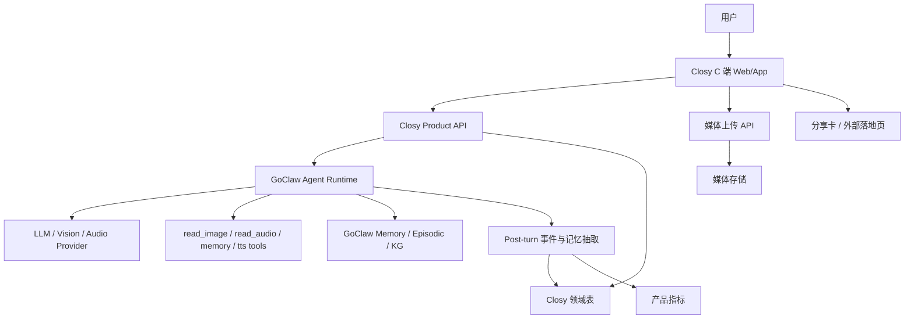
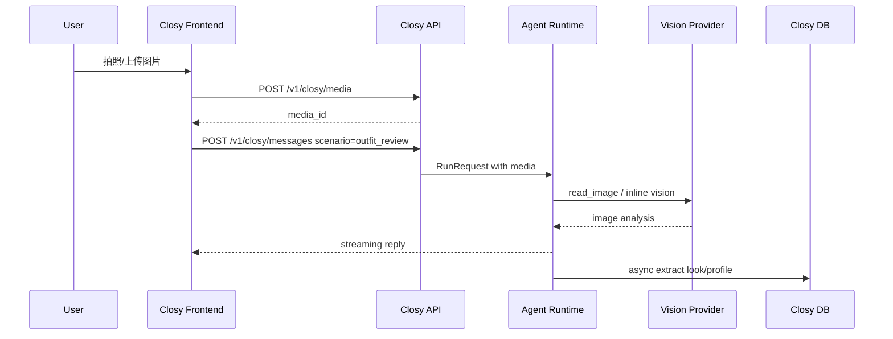
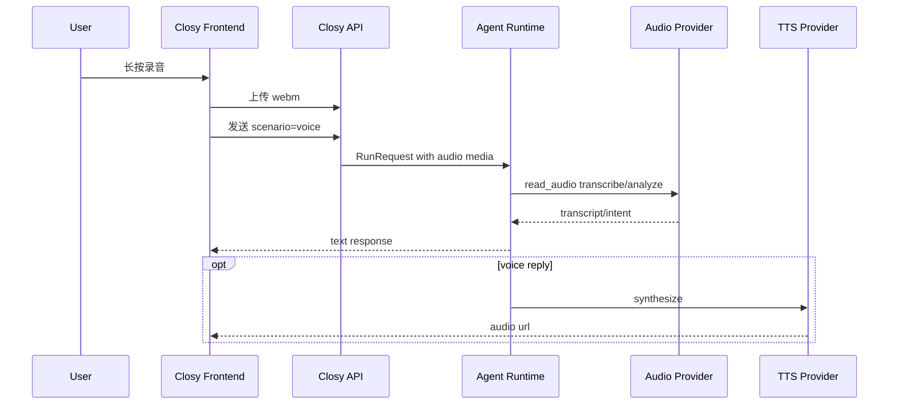
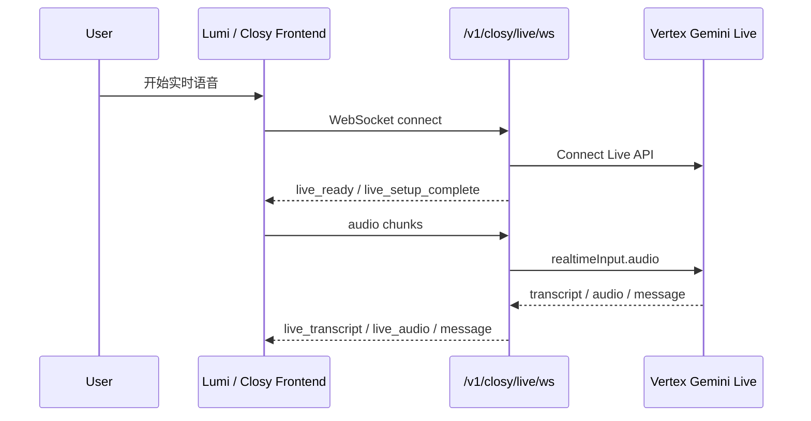

# Closy 实施方案：基于 GoClaw 改造穿搭搭子型单角色 Agent

本文档基于 [Closy PRD](./prd.zh-CN.md) 与当前 GoClaw 技术架构整理，目标是把产品需求转化为可执行的工程实施方案。

结论先行：当前项目已经具备 GoClaw Agent Runtime、多模态 Provider 底座和 `lumi` C 端前端雏形，但还不能直接作为 Closy 产品上线。推荐采用“GoClaw 内核 + lumi C 端产品层”的改造方式：不重写底层 Agent 系统，也不新建一套 C 端工程，而是在现有 `lumi` 上完成业务适配。

---

## 实施进展

### 2026-05-22：Vertex 多模态底座接入

- 已新增普通 `vertex` provider，可通过 Vertex AI `generateContent` / `streamGenerateContent` 接入 Gemini 文本、视觉与工具调用链路。
- 已新增 Vertex OAuth token 获取能力，支持 provider `api_key` 作为 access token，也支持 `GOCLAW_VERTEX_ACCESS_TOKEN`、`GOOGLE_APPLICATION_CREDENTIALS`、`GOOGLE_APPLICATION_CREDENTIALS_JSON` 与本地 `gcloud auth print-access-token`。
- 已新增 Vertex Gemini Live WebSocket 桥，路由为 `/v1/vertex/live/ws`，并为 Closy 暴露别名 `/v1/closy/live/ws`。
- Live WS 支持浏览器发送 `audio`、`audio_end`、`activity_start`、`activity_end`、`text`、`close` 事件，后端返回 `live_ready`、`live_setup_complete`、`live_transcript`、`live_audio`、`message`、`done`。
- 下一步 Phase 1 的 C 端页面可以直接接 `/v1/closy/live/ws` 做实时语音入口；普通图文聊天继续使用 `agent:closy`。

### 2026-05-23：独立 Gemini Live 后端接入

- 为避免影响既有 Live 桥，新增独立后端路由 `GET /v1/gemini/live/ws` 与 `GET /v1/closy/live/gemini/ws`。
- 新路由参考 `claude-codex` 的 Gemini Flash Live 实现，默认使用 `gemini-live-2.5-flash-preview-native-audio-09-2025`、Vertex `v1beta1` 双向 WebSocket。
- 新路由支持 `audio`、`audio_end`、`activity_start`、`activity_end`、`text`、`close` 客户端事件，返回 `live_ready`、`live_setup_complete`、`live_transcript`、`live_audio`、`message`、`done`、`error`。
- 新路由支持可配置 VAD 参数，并把 Mochi agent context files 与最近 live transcript 注入 `systemInstruction`。
- 新路由会把完成的 live turn 写入现有 session history，便于后续做记忆沉淀；旧 `/v1/vertex/live/ws` 和 `/v1/closy/live/ws` 保持不变。
- 已同步 `.env.local`、`.env.example` 与 `docs/vertex-provider-live.md`，将 claude-codex 的 Live 配置语义映射为 `GOCLAW_GEMINI_LIVE_*` 配置，不再保留旧命名环境变量。

### 2026-05-22：C 端前端代码基线确认

- 当前仓库已经拆成两个同级工程：`goclaw` 为 Go 后端，`lumi` 为 Closy/Lumi C 端前端。
- `lumi` 是 Next.js App Router 项目，不是 Vite 项目；页面入口位于 `lumi/src/app`，业务组件位于 `lumi/src/components/app`。
- 当前 C 端已有首页、聊天、相机、Live、保存穿搭、记忆、个人中心与 onboarding 页面：
  - `/`：首页，`HomeView`。
  - `/chat`：聊天页，`ChatView`。
  - `/camera`：拍照/上传分析页，`CameraView`。
  - `/live`：语音实时页，`LiveView`。
  - `/looks`：保存穿搭页，`LooksView`。
  - `/memory`：记忆页，`MemoryView`。
  - `/profile`、`/onboarding`：个人与引导页面。
- 前端 API 入口为 `lumi/src/lib/api/client.ts`。未设置 `NEXT_PUBLIC_API_BASE_URL` 时，大多数能力走 mock；聊天默认通过 Next.js 代理路由 `/api/chat/completions` 调用 GoClaw。
- 当前聊天链路为：`ChatView -> apiClient.sendMessage -> mock client -> /api/chat/completions -> GoClaw /v1/chat/completions`。
- `lumi/src/app/api/chat/completions/route.ts` 目前将前端消息转换成 OpenAI Chat Completions 格式，默认调用 `agent:closy`。
- 当前前端聊天代理已支持 SSE：前端请求 `Accept: text/event-stream` 时，上游使用 `stream:true`，`ChatView` 会按 `assistant_delta` 增量渲染。
- `/live` 当前主要是麦克风权限与 UI 状态模拟，尚未接入 `/v1/closy/live/ws`。
- `/camera` 当前使用本地 file input / capture 预览和 mock 分析，尚未上传到 GoClaw 媒体存储或调用真实视觉链路。
- `/memory` 当前展示 mock 的风格画像、偏好和 recent looks，尚未读取 GoClaw memory/KG 或 Closy 领域表。

### 2026-05-22：Phase 1 身份统一启动

- 后端调用 key / model key 保持 `agent:closy`，避免破坏现有 `/v1/chat/completions` 请求。
- 用户可见角色名修正为 `Mochi`：当前数据库中 `agents.display_name`、`frontmatter`、`agent_description` 已同步。
- 当前数据库中的 `IDENTITY.md`、`SOUL.md`、`AGENTS.md`、`USER_PREDEFINED.md` 等 agent context files 已统一到 Mochi 角色语义。
- 后端 seed 源码 `internal/closy/seed.go` 已同步为 `DisplayName = "Mochi"`，后续新环境默认也会创建 Mochi 展示名。
- `lumi` 前端中的用户可见 `Closy` 文案已改为 `Mochi`，chat proxy 默认 model 已从 `agent:fox-spirit` 改为 `agent:closy`。

### 2026-05-22：Phase 1 聊天流式代理接入

- `lumi` 的 `/api/chat/completions` 在前端请求 `Accept: text/event-stream` 时，会以 `stream:true` 请求 GoClaw `/v1/chat/completions`。
- Next.js chat proxy 会把 GoClaw OpenAI-compatible SSE chunk 转换成前端事件：`assistant_start`、`assistant_delta`、`done`、`error`。
- `ChatView` 现在会先插入 Mochi 占位消息，再按 `assistant_delta` 增量更新内容，最终用 `done.result` 替换为完整消息。
- 旧 JSON 响应路径保留：未请求 SSE 时仍返回原来的 `{ userMessage, assistantMessage }`。

### 2026-05-22：Phase 1 C 端附件上传后端链路

- 已新增 C 端专用上传接口 `POST /v1/chat/attachments/upload`，返回可在聊天请求中复用的 `media_id`。
- 已新增 `media_assets` 表记录附件元数据，当前使用本地 `media.Store` 保存文件，预留 `storage_backend` / `bucket` / `key` 以便后续切换对象存储。
- `/v1/chat/completions` 已支持 `attachments: [{ "media_id": "..." }]`，运行 Agent 时会把附件转换为 `RunRequest.Media` 并把媒体标签注入最后一条用户消息。
- C 端 chat 附件中的图片会强制 inline 到当前 agent 主模型，适配 `shortapi / openai/gpt-5.4` 这类支持多模态的 OpenAI-compatible 模型；全局 `read_image` 工具配置保持不变。
- 控制台原有 `/v1/media/upload` 不变，避免影响 WebSocket 控制台聊天和旧媒体流程。

---

## 1. 实施目标

### 1.1 产品目标

实现一个以穿搭、OOTD、自拍、即时拍摄、买前决策为入口，以长期陪伴、记忆、语音关系感为留存核心的单角色 Agent 产品。

MVP 要验证：

1. 用户是否会把 Closy 当作固定对象反复使用。
2. 用户是否会在穿搭任务之外回来聊天。
3. 视觉入口是否显著降低使用门槛。
4. 语音是否提升状态表达、陪伴感和会话轮数。
5. 用户是否愿意分享 Closy 的点评或关系金句。
6. 长期记忆是否带来“她懂我”的感受。

### 1.2 技术目标

在不破坏现有 GoClaw 管理后台和 Agent Runtime 的前提下，新增 Closy 产品层：

- 单角色 Closy 专用体验入口。
- 视觉优先的图片/自拍/相机上传链路。
- 语音输入、音频理解和可选语音回复链路。
- Closy 领域记忆与用户风格画像。
- 分享卡片与外部角色场景落地页。
- 面向产品验证的事件埋点与指标系统。

---

## 2. 范围划分

### 2.1 MVP 范围

MVP 必做：

- Closy 单角色初始化与固定路由。
- C 端聊天主页。
- 图片上传、自拍/拍摄入口、二选一入口。
- 语音录制上传、音频转写/理解。
- 基于图片与语音的 Agent 对话。
- 结构化风格画像和偏好记忆。
- “Closy 记得你”页面。
- 轻量分享卡生成。
- 外部落地页。
- 核心产品事件埋点。

MVP 不做：

- 多角色市场。
- 用户 feed。
- 完整社交关系链。
- 群聊/房间。
- 完整购物闭环。
- 重社区与推荐系统。
- 复杂虚拟人实时语音通话。

### 2.2 后续增强范围

- 更自然的实时语音对话。
- 自动回访和轻主动消息。
- 更细颗粒度的风格知识图谱。
- 多角色扩展。
- 站外增长链路优化。
- 订阅与付费。

---

## 3. 总体架构

### 3.1 推荐架构



### 3.2 分层职责

| 层级 | 职责 | 当前项目复用情况 |
| --- | --- | --- |
| Closy C 端 | 消费级聊天、拍照、自拍、语音、分享、记忆展示 | 已有 `lumi` Next.js MVP，需从 mock 改为真实后端 |
| Closy Product API | 用户态 API、场景入口、领域数据、埋点 | 需要新增 |
| GoClaw Agent Runtime | Agent loop、工具调用、Provider、会话、记忆注入 | 直接复用 |
| 多模态工具层 | 图片理解、音频理解、TTS、媒体存储 | 已有 `read_image`、`read_audio`、`tts`，并新增 Vertex/Live 底座 |
| 领域记忆层 | 风格画像、look 记录、偏好、状态线索 | 需要新增 |
| 管理后台 | Agent/Provider/TTS/Memory/Usage 配置 | 复用现有 UI |

---

## 4. 现有能力复用清单

### 4.1 Agent Runtime

当前 GoClaw 已有 Agent Router、Agent Loop、Provider Registry、Tool Registry、Session Store、Memory Store，可作为 Closy 的核心运行时。

复用方式：

- 创建固定 agent key：`closy`。
- 将 Closy 人设、边界、输出结构写入 agent system prompt。
- 所有用户消息进入同一个 Closy agent。
- 使用 `tenant_id + user_id + agent_id` 保证用户隔离。

### 4.2 媒体上传与多模态

当前聊天输入已经支持附件上传和录音上传；后端有 `/v1/media/upload` 和媒体持久化链路。Agent 运行时会把图片、音频、文档等媒体转为 `MediaRef`，并注入工具上下文。

复用方式：

- 图片：复用 `read_image` 工具或 vision-capable main model。
- 音频：复用 `read_audio` 工具进行转写/理解。
- 媒体展示：复用现有 media URL 签名和文件服务机制。

需要增强：

- 前端增加相机/自拍一级入口。
- 图片上传后进入“关系会话”，而不是普通附件展示。
- 为二选一、买前决策、OOTD 点评生成特定 prompt。
- 语音消息需要有更自然的 UI 展示和转写结果。

### 4.3 记忆系统

当前系统已有 memory documents、episodic summaries、knowledge graph、memory auto-inject。

复用方式：

- 长期自由文本记忆继续进入 GoClaw memory。
- 会话摘要继续进入 episodic memory。
- 重要偏好可以同步进入 knowledge graph。

需要增强：

- 新增 Closy 领域结构化记忆表。
- Post-turn 抽取风格偏好、颜色偏好、版型偏好、状态线索、社交呈现偏好。
- “Closy 记得你”页面优先展示结构化领域记忆，而不是通用 memory 文档。

### 4.4 TTS/STT

当前项目已有 TTS 配置与多个 TTS provider，也有音频理解工具。

复用方式：

- 语音输入 MVP 阶段走“录音上传 -> `read_audio` 转写/理解 -> Agent 回复”。
- 语音回复 MVP 阶段走“Agent 文本回复 -> TTS 生成音频 -> 前端播放”。

需要增强：

- 给 Closy 回复增加“自动语音化”开关。
- 给语音用户使用更口语化的回复策略。
- 保存用户偏好的交互方式：文字、语音、自拍。

---

## 5. 数据模型设计

### 5.1 新增表概览

建议新增以下 Closy 领域表：

```text
closy_profiles
closy_style_preferences
closy_looks
closy_decisions
closy_share_cards
closy_events
closy_user_settings
```

### 5.2 closy_profiles

用户级风格画像主表。

字段建议：

| 字段 | 类型 | 说明 |
| --- | --- | --- |
| id | uuid | 主键 |
| tenant_id | uuid | 租户 |
| user_id | text | 用户 ID |
| agent_id | uuid | Closy agent ID |
| style_summary | text | 风格画像摘要 |
| self_expression_summary | text | 自我表达偏好 |
| social_presentation_summary | text | 社交呈现偏好 |
| current_state_summary | text | 最近状态摘要 |
| confidence | numeric | 画像置信度 |
| created_at | timestamptz | 创建时间 |
| updated_at | timestamptz | 更新时间 |

唯一索引：

```sql
UNIQUE (tenant_id, user_id, agent_id)
```

### 5.3 closy_style_preferences

结构化偏好条目。

字段建议：

| 字段 | 类型 | 说明 |
| --- | --- | --- |
| id | uuid | 主键 |
| tenant_id | uuid | 租户 |
| user_id | text | 用户 ID |
| agent_id | uuid | Closy agent ID |
| category | text | 颜色、版型、材质、风格、场景等 |
| polarity | text | like / dislike / neutral |
| value | text | 偏好内容 |
| evidence | text | 来源证据 |
| source_session_key | text | 来源会话 |
| confidence | numeric | 置信度 |
| created_at | timestamptz | 创建时间 |
| updated_at | timestamptz | 更新时间 |

示例：

```json
{
  "category": "color",
  "polarity": "like",
  "value": "低饱和蓝灰色",
  "evidence": "用户多次表示喜欢松弛、干净、不太用力的感觉",
  "confidence": 0.72
}
```

### 5.4 closy_looks

保存用户上传过的 look、自拍、商品图或截图。

字段建议：

| 字段 | 类型 | 说明 |
| --- | --- | --- |
| id | uuid | 主键 |
| tenant_id | uuid | 租户 |
| user_id | text | 用户 ID |
| agent_id | uuid | Closy agent ID |
| session_key | text | 会话 |
| media_id | text | 媒体 ID |
| media_path | text | 文件路径 |
| look_type | text | outfit / selfie / product / story / comparison |
| scene | text | 出门、上班、约会、试衣间等 |
| analysis_summary | text | 视觉分析摘要 |
| closy_judgement | text | Closy 判断 |
| tags | jsonb | 风格标签 |
| created_at | timestamptz | 创建时间 |

### 5.5 closy_decisions

保存明确决策类场景。

字段建议：

| 字段 | 类型 | 说明 |
| --- | --- | --- |
| id | uuid | 主键 |
| tenant_id | uuid | 租户 |
| user_id | text | 用户 ID |
| agent_id | uuid | Closy agent ID |
| session_key | text | 会话 |
| decision_type | text | ootd / compare / purchase / social |
| options | jsonb | 选项信息 |
| choice | text | 选择结果 |
| reason | text | 理由 |
| shareable_quote | text | 适合分享的一句话 |
| created_at | timestamptz | 创建时间 |

### 5.6 closy_share_cards

保存分享卡生成记录。

字段建议：

| 字段 | 类型 | 说明 |
| --- | --- | --- |
| id | uuid | 主键 |
| tenant_id | uuid | 租户 |
| user_id | text | 用户 ID |
| agent_id | uuid | Closy agent ID |
| source_session_key | text | 来源会话 |
| source_message_id | text | 来源消息 |
| card_type | text | outfit_judgement / quote / comparison |
| title | text | 标题 |
| content | text | 卡片内容 |
| media_ids | jsonb | 图片列表 |
| token | text | 外部访问 token |
| expires_at | timestamptz | 过期时间，可空 |
| created_at | timestamptz | 创建时间 |

### 5.7 closy_events

产品事件表，服务 MVP 指标验证。

字段建议：

| 字段 | 类型 | 说明 |
| --- | --- | --- |
| id | uuid | 主键 |
| tenant_id | uuid | 租户 |
| user_id | text | 用户 ID |
| agent_id | uuid | Closy agent ID |
| session_key | text | 会话，可空 |
| event_name | text | 事件名 |
| properties | jsonb | 事件属性 |
| created_at | timestamptz | 创建时间 |

核心事件：

- `closy_opened`
- `closy_message_sent`
- `closy_photo_uploaded`
- `closy_camera_used`
- `closy_selfie_used`
- `closy_voice_recorded`
- `closy_voice_reply_played`
- `closy_decision_requested`
- `closy_share_card_created`
- `closy_share_card_opened`
- `closy_memory_referenced`
- `closy_profile_viewed`
- `closy_returned_7d`

---

## 6. API 设计

### 6.0 当前 API 基线

当前 GoClaw 已存在并可复用的接口：

| 接口 | 状态 | Closy 用法 |
| --- | --- | --- |
| `POST /v1/chat/completions` | 已实现 | 普通图文聊天，模型使用 `agent:closy` |
| `POST /v1/chat/attachments/upload` | 已实现 | C 端聊天附件上传，返回 `media_id` 给 `/v1/chat/completions.attachments` 使用 |
| `POST /v1/responses` | 已实现 | 可作为后续更结构化的 Agent 调用入口 |
| `GET /v1/closy/live/ws` | 已实现 | Vertex Gemini Live WebSocket 别名 |
| `GET /v1/vertex/live/ws` | 已实现 | 通用 Vertex Live WebSocket |
| `GET /v1/closy/live/gemini/ws` | 已实现 | 新增独立 Gemini Live 路由，不替换旧 Live |
| `GET /v1/gemini/live/ws` | 已实现 | 通用独立 Gemini Live 路由 |
| `POST /v1/tools/invoke` | 已实现 | 调用工具，非 C 端首选 |
| 媒体上传/文件服务 | 已有底层能力 | C 端先走专用 upload + media_assets，控制台继续走旧 `/v1/media/upload` |

当前 `lumi` 前端已经有 Next.js 代理：

```http
POST /api/chat/completions
```

该代理会请求 GoClaw：

```http
POST /v1/chat/completions
```

短期实施策略：

1. Phase 1 先复用 `/v1/chat/completions` + `agent:closy`，让 C 端聊天和图片入口跑通。
2. `/api/chat/completions` 继续作为前端 BFF，负责隐藏 gateway token、补齐 `X-GoClaw-User-Id` / `X-GoClaw-Tenant-Id`。
3. Closy 专用 `/v1/closy/*` API 作为领域层逐步新增，不阻塞 C 端第一阶段验证。

### 6.1 Closy 消息发送

```http
POST /v1/closy/messages
```

请求：

```json
{
  "message": "你帮我看这套适不适合今天出门",
  "session_key": "agent:closy:direct:user-a",
  "scenario": "outfit_review",
  "media": [
    {
      "media_id": "m_123",
      "kind": "image"
    }
  ],
  "reply_mode": "text"
}
```

响应：

```json
{
  "run_id": "run_123",
  "session_key": "agent:closy:direct:user-a",
  "status": "started"
}
```

说明：

- 该接口为目标态 Closy Product API；当前尚未实现。
- Phase 1 可以先由 `lumi/src/app/api/chat/completions/route.ts` 代理到 `/v1/chat/completions`。
- 内部仍调用现有 Agent Runtime。
- `scenario` 用于构造 Closy 场景 prompt。
- 支持 SSE 或 WebSocket 复用现有 streaming。

### 6.2 媒体上传

```http
POST /v1/chat/attachments/upload
```

请求：

```http
Content-Type: multipart/form-data
file=<image/audio/video/document>
session_id=<optional c-side session id>
agent_id=<optional agent uuid>
```

响应：

```json
{
  "media_id": "019e4fb1-169c-7e77-9f22-b311bc729410",
  "filename": "selfie.jpg",
  "mime_type": "image/jpeg",
  "size": 123456,
  "sha256": "abc123",
  "storage": "local",
  "status": "ready"
}
```

说明：

- 该接口专供 C 端聊天链路使用，不替换控制台已有 `/v1/media/upload`。
- 上传成功后，C 端在 `/v1/chat/completions` 请求中传 `attachments: [{ "media_id": "..." }]`。
- 当前文件落本地 `media.Store`，元数据进入 `media_assets`。C 端聊天图片默认 inline 给当前主模型；后续对象存储接入时保持 `media_id` API 不变，只切换 `storage_backend` / `storage_bucket` / `storage_key` 的写入与读取实现。
- 目标态 `/v1/closy/media` 仍可作为领域 API 增量封装，用于补充 `source=camera/selfie/gallery/voice`、look 归档和埋点。

### 6.3 获取 Closy 用户画像

```http
GET /v1/closy/profile
```

响应：

```json
{
  "style_summary": "你整体更适合干净、松弛、不过度用力的表达。",
  "self_expression_summary": "你经常在利落和亲近感之间摇摆。",
  "social_presentation_summary": "你对'显得太刻意'比较敏感。",
  "current_state_summary": "最近你更想要稳住状态，而不是追求惊艳。",
  "preferences": [
    {
      "category": "style",
      "polarity": "like",
      "value": "松弛、干净、利落"
    }
  ],
  "recent_looks": []
}
```

### 6.4 更新/删除记忆

```http
PATCH /v1/closy/profile/preferences/{id}
DELETE /v1/closy/profile/preferences/{id}
```

用途：

- 用户可以纠正 Closy 的记忆。
- 满足 PRD 中“记忆管理”和隐私控制。

### 6.5 创建分享卡

```http
POST /v1/closy/share-cards
```

请求：

```json
{
  "source_session_key": "agent:closy:direct:user-a",
  "source_message_id": "msg_123",
  "card_type": "outfit_judgement",
  "title": "Closy 站这套",
  "content": "它不是最抢眼，但更像你。"
}
```

响应：

```json
{
  "id": "card_123",
  "token": "public_token",
  "share_url": "/s/public_token"
}
```

### 6.6 外部落地页

```http
GET /s/{token}
```

用途：

- 站外用户点击分享卡后进入 Closy 场景落地页。
- 页面展示角色、卡片内容和 CTA：发穿搭图、现在自拍、给我发语音。

### 6.7 Closy Live WebSocket

当前已实现：

```http
GET /v1/closy/live/ws
```

鉴权：

- `Authorization: Bearer <GOCLAW_GATEWAY_TOKEN>`
- 或 query 参数 `?token=<GOCLAW_GATEWAY_TOKEN>`。

可选 query：

```text
model=gemini-live-2.5-flash-native-audio
project_id=<google cloud project>
location=us-central1
input_mime=audio/pcm;rate=16000
output_mime=<可选>
input_transcription=true
output_transcription=true
timeout=10m
```

前端发送事件：

```json
{ "type": "audio", "mime_type": "audio/pcm;rate=16000", "data": "<base64>" }
```

```json
{ "type": "audio_end" }
```

```json
{ "type": "text", "content": "帮我判断今天这套状态" }
```

```json
{ "type": "close" }
```

后端返回事件：

```json
{ "type": "live_ready", "data": { "model": "gemini-live-2.5-flash-native-audio" } }
```

```json
{ "type": "live_setup_complete" }
```

```json
{ "type": "live_transcript", "role": "user", "content": "..." }
```

```json
{ "type": "live_audio", "data": { "mime_type": "...", "data": "<base64>" } }
```

```json
{ "type": "message", "role": "assistant", "content": "..." }
```

```json
{ "type": "done" }
```

注意：

- 当前 Live WS 是 Vertex Live 桥，不经过普通 `agent:closy` loop；它解决低延迟语音体验，但不会天然写入 GoClaw session/memory。
- 若产品需要 Live 会话沉淀记忆，需要新增 Live transcript 落库和 post-turn 抽取。

---

## 7. 前端实施方案

### 7.1 当前前端工程基线

当前 C 端前端已经存在，不再从 `ui/web` 管理后台内新增页面。后续改造目标是继续使用 `lumi` 工程作为 Closy C 端主应用。

```text
lumi/
  src/app/                         Next.js App Router 页面入口
  src/components/app/              C 端业务视图组件
  src/components/ui/               通用 UI 组件
  src/lib/api/                     API 适配层
  src/lib/store/use-lumi-store.ts  Zustand 本地状态
  src/lib/data/mochi.ts            当前角色和 mock 种子数据
  src/types/lumi.ts                前端领域类型
```

当前技术栈：

- Next.js 16 App Router。
- React 19。
- TanStack React Query 管理服务端状态。
- Zustand 管理少量本地状态。
- Tailwind CSS v4。
- lucide-react 图标。
- Framer Motion 动效。
- Vitest + Playwright 测试。

### 7.2 当前路由与改造方向

当前 `lumi` 已有路由：

```text
/             首页
/chat         文本聊天
/camera       拍照/上传图片
/live         语音实时页
/looks        保存穿搭
/memory       记忆展示
/profile      个人中心
/onboarding   引导页
```

短期不再新增 `/closy/*` 路由组，避免重复建设。MVP 以 `lumi` 现有路由为 C 端正式路由。后端 agent key 保持 `closy`，用户侧角色名统一为 `Mochi`：

| 当前路由 | 当前状态 | Phase 1 改造目标 |
| --- | --- | --- |
| `/` | 已有角色首页和 mock 数据 | 改为 Mochi 首页，突出穿搭图、自拍、语音、状态入口 |
| `/chat` | 已有聊天 UI，可通过 Next proxy 调 GoClaw | 改为 `agent:closy`，补 scenario、媒体、流式渲染 |
| `/camera` | 已有 file input/capture 与本地预览 | 接 GoClaw 媒体上传和视觉分析链路 |
| `/live` | 已有麦克风权限和模拟状态 | 接 `/v1/closy/live/ws` |
| `/looks` | mock 保存穿搭 | 接 `closy_looks` 或最小 API |
| `/memory` | mock 画像/偏好 | 接 `closy_profiles`、`closy_style_preferences`、memory/KG |
| `/profile` | 静态个人页 | 增加隐私、记忆、语音偏好设置 |

后续如果需要和管理后台共存于同一域名，可再加 `/closy` 前缀或部署层 rewrite；当前实施阶段不把路由重构作为优先任务。

### 7.3 当前 API 适配层

前端统一通过 `createLumiApiClient()` 获取 API client：

```text
src/lib/api/client.ts
src/lib/api/mock.ts
src/lib/api/http.ts
src/lib/api/go-claw-chat.ts
src/app/api/chat/completions/route.ts
```

当前行为：

- 设置 `NEXT_PUBLIC_API_BASE_URL` 时，走 `http.ts` 中定义的业务后端接口。
- 未设置 `NEXT_PUBLIC_API_BASE_URL` 时，走 `mock.ts`。
- mock 模式下，聊天默认仍会调用 `/api/chat/completions`。
- `/api/chat/completions` 是 Next.js server route，负责把 Lumi 的 `ChatMessage` 历史转换为 OpenAI-compatible messages，再请求 GoClaw `/v1/chat/completions`。

当前需要修正：

1. `.env.example` 和代理路由默认值统一为 `agent:closy`。
2. `ChatRole` 中的 `mochi` 可保留为用户侧角色名，后续如需要更通用数据层再迁移为 `assistant`。
3. `MochiConversation.agentId` 需要改为 `closy` 或更通用的 `AgentConversation`。
4. `src/lib/data/mochi.ts` 保留为角色数据源；如果未来产品名和角色名分离，再拆成 product/agent 两层数据。
5. `/api/chat/completions` 当前 `stream: false`，如果要实现真正 SSE，需要改造为：
   - 上游请求 `stream: true`。
   - Next route 返回 `text/event-stream` 或 Web Streams。
   - 前端 `sendMessage` 支持增量更新 assistant message。

### 7.4 页面改造清单

#### 首页 `/`

当前：`HomeView` 展示 Mochi 在线、三个入口、今日 prompt、角色 traits、隐私提示和 latest look。

改造目标：

- 首屏角色统一为 Mochi。
- 三个主入口保留，但文案改为“发穿搭图 / 语音聊聊 / 自拍看看”。
- 增加场景快捷入口：
  - 这套今天能出门吗。
  - 帮我二选一。
  - 这件值不值得买。
  - 我今天想显得什么状态。
- 首屏显示最近记忆卡片：偏好色、最近 look、最近状态关键词。

#### 聊天页 `/chat`

当前：`ChatView` 已有消息列表、输入框、图片附件按钮、麦克风按钮、乐观更新、失败重试。

改造目标：

- 默认模型改为 `agent:closy`。
- 请求中增加 `scenario`、`media`、`reply_mode` 等 Closy 上下文。
- 图片附件不再只是 `attachment://filename`，而是先上传媒体并拿到 `media_id`。
- 支持真正 SSE 流式渲染：pending assistant message 随 chunk 增量更新。
- 将 voice 按钮拆成两种模式：
  - MVP：长按/点击录音 -> 上传音频 -> 普通 chat。
  - Live：进入 `/live` 的实时 WebSocket 模式。
- 增加从 assistant message 生成分享卡的入口。

#### 相机页 `/camera`

当前：`CameraView` 已有 file input、移动端 `capture="environment"`、预览和 mock 分析。

改造目标：

- 保留 `<input type="file" accept="image/*" capture="environment">` 作为 MVP 方案。
- 增加自拍入口：`capture="user"`。
- 图片选择后压缩并上传到 GoClaw media。
- 触发 Closy 场景：`outfit_review`、`selfie_review`、`purchase`、`compare`。
- 分析完成后可保存到 `/looks`，并沉淀到 `closy_looks`。

#### Live 页 `/live`

当前：`LiveView` 只做麦克风权限、状态动画和模拟状态流转。

改造目标：

- 建立浏览器 WebSocket 到 `/v1/closy/live/ws`。
- 采集麦克风 PCM 或可被后端接受的音频片段，按 `audio` 事件发送 base64。
- 处理后端事件：
  - `live_ready`
  - `live_setup_complete`
  - `live_transcript`
  - `live_audio`
  - `message`
  - `done`
  - `error`
- 支持断开、重连、打断和静音状态。
- 将 transcript 和 assistant message 选择性写入普通会话历史。

#### 记忆页 `/memory`

当前：`MemoryView` 展示 mock 的 style profile、recent look、avoid notes、state keywords。

改造目标：

- 数据来源改为 `GET /v1/closy/profile`。
- 展示 `style_summary`、`self_expression_summary`、`social_presentation_summary`、`current_state_summary`。
- 展示结构化 preference 列表，并支持删除/纠正。
- 展示 recent looks。
- 标注哪些记忆来自用户明确表达，哪些来自 Closy 推断。

#### 保存穿搭 `/looks`

当前：`LooksView` 使用 mock seed looks，可本地切换 private/public、生成假 share link。

改造目标：

- 数据来源改为 `GET /v1/closy/looks` 或 `GET /v1/closy/profile` 内的 `recent_looks`。
- 支持保存、删除、公开/私密切换。
- 分享 link 调用 `POST /v1/closy/share-cards`。

### 7.5 前端代码整理任务

为了避免角色名和后端 key 混用，Phase 1 需要先做一次语义清理：

```text
后端 model key                         -> agent:closy
用户可见角色名                         -> Mochi
ChatRole: "mochi"                      -> 当前保留，表示用户侧角色身份
HomeView/ChatView/Memory/Profile 文案   -> Mochi 文案
```

注意：这次清理只改 C 端语义，不重构 UI 结构，不引入新的前端状态库，不改变 Next.js 工程形态。

---

## 8. 后端实施方案

### 8.1 Closy Handler

目标态新增 HTTP handler：

```text
internal/http/closy.go
internal/http/closy_media.go
internal/http/closy_profile.go
internal/http/closy_share.go
internal/http/closy_events.go
```

当前状态：

- 尚未新增完整 `internal/http/closy*.go` 领域 handler。
- 已新增 `internal/http/vertex_live.go`，并注册：
  - `GET /v1/vertex/live/ws`
  - `GET /v1/closy/live/ws`
- 普通 C 端聊天当前复用 `POST /v1/chat/completions`。

目标态注册路由：

```go
mux.HandleFunc("POST /v1/closy/messages", h.auth(h.handleSendMessage))
mux.HandleFunc("POST /v1/closy/media", h.auth(h.handleUploadMedia))
mux.HandleFunc("GET /v1/closy/profile", h.auth(h.handleGetProfile))
mux.HandleFunc("PATCH /v1/closy/profile/preferences/{id}", h.auth(h.handleUpdatePreference))
mux.HandleFunc("DELETE /v1/closy/profile/preferences/{id}", h.auth(h.handleDeletePreference))
mux.HandleFunc("POST /v1/closy/share-cards", h.auth(h.handleCreateShareCard))
mux.HandleFunc("GET /v1/closy/share-cards/{id}", h.auth(h.handleGetShareCard))
mux.HandleFunc("POST /v1/closy/events", h.auth(h.handleTrackEvent))
mux.HandleFunc("GET /s/{token}", h.handlePublicShareLanding)
```

实施顺序建议：

1. 先保留 `/v1/chat/completions` 作为聊天主入口。
2. 新增 `/v1/closy/profile` 和 `/v1/closy/events`，让 `lumi` 的 `/memory` 与埋点先脱离 mock。
3. 再新增 `/v1/closy/media`、`/v1/closy/looks`、`/v1/closy/share-cards`。
4. 最后根据需要把 `/api/chat/completions` 迁移到 `/v1/closy/messages`。

### 8.2 Closy Store

新增 store interface：

```go
type ClosyStore interface {
    GetProfile(ctx context.Context, agentID, userID string) (*ClosyProfile, error)
    UpsertProfile(ctx context.Context, profile ClosyProfile) error
    ListPreferences(ctx context.Context, agentID, userID string) ([]ClosyPreference, error)
    UpsertPreference(ctx context.Context, pref ClosyPreference) error
    DeletePreference(ctx context.Context, id string) error
    CreateLook(ctx context.Context, look ClosyLook) error
    ListRecentLooks(ctx context.Context, agentID, userID string, limit int) ([]ClosyLook, error)
    CreateDecision(ctx context.Context, decision ClosyDecision) error
    CreateShareCard(ctx context.Context, card ClosyShareCard) error
    GetShareCardByToken(ctx context.Context, token string) (*ClosyShareCard, error)
    TrackEvent(ctx context.Context, event ClosyEvent) error
}
```

实现：

```text
internal/store/pg/closy.go
internal/store/sqlitestore/closy.go
```

### 8.3 场景 Prompt Builder

新增：

```text
internal/closy/prompt.go
```

职责：

- 根据 `scenario` 构造本轮用户消息增强 prompt。
- 注入用户风格画像摘要。
- 注入最近 look、偏好、状态线索。
- 强制 Closy 保持角色边界。

场景枚举：

```go
const (
    ScenarioOutfitReview = "outfit_review"
    ScenarioSelfieReview = "selfie_review"
    ScenarioCompare      = "compare"
    ScenarioPurchase     = "purchase"
    ScenarioState        = "state"
    ScenarioStyleIdentity = "style_identity"
    ScenarioSocialPresentation = "social_presentation"
    ScenarioCasualChat   = "casual_chat"
    ScenarioVoice        = "voice"
)
```

### 8.4 Post-turn 领域抽取

新增：

```text
internal/closy/extractor.go
internal/closy/post_turn.go
```

每轮 Agent 完成后，异步抽取：

- 风格偏好。
- 不喜欢的风格或单品。
- 社交呈现偏好。
- 状态线索。
- 交互偏好。
- 可分享金句。
- look 结构化摘要。

建议输出 JSON schema：

```json
{
  "profile_patch": {
    "style_summary": "",
    "self_expression_summary": "",
    "social_presentation_summary": "",
    "current_state_summary": ""
  },
  "preferences": [
    {
      "category": "color",
      "polarity": "like",
      "value": "低饱和色",
      "evidence": "用户说不喜欢太用力",
      "confidence": 0.7
    }
  ],
  "look": {
    "look_type": "outfit",
    "scene": "出门前",
    "analysis_summary": "",
    "tags": ["松弛", "利落"]
  },
  "decision": {
    "decision_type": "compare",
    "choice": "left",
    "reason": "",
    "shareable_quote": ""
  }
}
```

MVP 可以先用 LLM extraction；后续再加规则兜底。

### 8.5 Closy Agent 初始化

当前已实现 seed：

```text
internal/closy/seed.go
```

当前 gateway 启动时会调用 `closy.EnsureSeed`：

- 固定 `agent_key = "closy"`。
- `display_name = "Mochi"`。
- `agent_type = predefined`。
- `memory_config.enabled = true`。
- `tools_config.alsoAllow` 包含 `read_image`、`read_audio`、`memory_search`、`memory_get`、`memory_expand`、`tts`。
- 自动写入 `SOUL.md`、`IDENTITY.md`、`CAPABILITIES.md`、`AGENTS.md` 等 agent context files。
- workspace 目录为 `<workspaceRoot>/closy`。
- `other_config.seed` 写入 Mochi seed manifest，包含 `version`、整体 `checksum` 和每个 context file 的 checksum。

目标态默认 agent：

```json
{
  "agent_key": "closy",
  "display_name": "Mochi",
  "agent_type": "predefined",
  "memory_config": {
    "enabled": true
  },
  "other_config": {
    "product": "closy",
    "prompt_mode": "full",
    "seed": {
      "agent_key": "closy",
      "display_name": "Mochi",
      "version": "2026-05-22.1",
      "checksum": "sha256:..."
    }
  },
  "tools_config": {
    "read_image": true,
    "read_audio": true,
    "memory_search": true,
    "tts": true
  }
}
```

System prompt 重点：

- 她是穿搭搭子，不是泛化陪聊。
- 必须围绕穿搭、审美、自我表达、状态、社交呈现。
- 图片点评需要先给结论，再给 1-2 个优先建议。
- 二选一必须明确站队。
- 买前决策要站在用户这边。
- 状态陪伴不鸡汤、不诊断心理疾病。
- 主动引用记忆时要自然克制。
- 可生成适合分享的一句话。

Seed 幂等与迁移规则：

- 首次初始化：创建 `agent_key = "closy"` 的 Mochi agent，写入当前代码内置的 `IDENTITY.md`、`SOUL.md` 等 context files，并记录 seed manifest。
- 重复初始化：如果 agent 与 context files 已存在且内容等于当前 seed，不写入任何 context file，不刷新 agent。
- 缺失补齐：如果某个 seed 管理的 context file 缺失或为空，只补齐该文件。
- 用户修改保护：如果 `IDENTITY.md`、`SOUL.md` 或其它 context file 已存在且内容不等于当前 seed，同时也不匹配上一版 manifest checksum，视为运营/本地手动修改，seed 不覆盖。
- 版本升级：如果上一版 manifest 证明某个文件仍是上一版 seed 的原始内容，则默认迁移到当前 seed；传入 `SeedOptions.SkipSeedMigrations = true` 时只检测不迁移，并保留旧 manifest，方便后续显式升级。
- 线上迁移：当前本地 Mochi 角色形态以代码内置 context files + `other_config.seed` manifest 为基线；迁移线上时应优先使用 agent export/import 携带完整 agent row、context files、provider/model 配置，再由 seed 补齐缺失项，不依赖 seed 覆盖线上已有人工调整。

后续待补：

- 提供显式 CLI/API：重新初始化 Closy、只补缺失 context file、不覆盖运营手动修改。
- 把 `lumi` 默认环境变量和 OpenAPI 示例统一改为 `agent:closy`。

---

## 9. 多模态链路设计

### 9.1 图片/自拍链路



### 9.2 语音链路

MVP 低风险链路：



当前已具备的实时链路：



实施取舍：

- Phase 1 可以先实现 `/live` 到 `/v1/closy/live/ws` 的实时语音体验。
- 因 Live WS 当前不进入 `agent:closy` loop，Phase 1 不把 Live transcript 自动写入长期记忆。
- Phase 2/3 再补 transcript 保存、摘要、记忆抽取和普通 chat history 合并。

后续增强：

- WebRTC 实时语音。
- 流式 STT。
- 低延迟 TTS。
- 用户打断和半双工对话。

---

## 10. 指标与埋点

### 10.1 北极星指标

7 日内重复打开并发起对话/上传图片/自拍/语音的用户占比。

### 10.2 核心指标

| 指标 | 事件来源 |
| --- | --- |
| 首次互动转化率 | `closy_opened` -> `closy_message_sent` |
| 图片入口使用率 | `closy_photo_uploaded` / active users |
| 自拍入口使用率 | `closy_selfie_used` / active users |
| 语音入口使用率 | `closy_voice_recorded` / active users |
| 语音后平均轮数 | voice session turn count |
| 7 日复访 | `closy_returned_7d` |
| 分享卡生成率 | `closy_share_card_created` / active users |
| 分享访问转化率 | `closy_share_card_opened` -> signup/chat |
| 记忆引用正反馈 | `closy_memory_referenced` + user feedback |

### 10.3 事件采集策略

- 前端直接采集 UI 行为事件。
- 后端采集 Agent run、media、share、profile 更新事件。
- Post-turn 抽取时记录记忆是否被引用。
- 初期写入 `closy_events` 即可，后续可接入外部分析系统。

---

## 11. 安全与隐私

### 11.1 图片与自拍

要求：

- 所有媒体按 tenant/user 隔离。
- 图片 URL 使用短期签名或鉴权访问。
- 分享卡默认不公开原图，除非用户明确选择。
- 删除 look 时同步删除或失效媒体引用。

### 11.2 语音

要求：

- 录音文件与转写文本均视为敏感数据。
- 用户可删除语音与转写记录。
- 不默认公开语音内容。
- 分享语音转文字金句时需要用户确认。

### 11.3 记忆

要求：

- 用户可查看、删除、纠正记忆。
- 高敏感内容不自动进入风格画像。
- 医疗、心理诊断、危险行为等内容不作为 Closy 专业判断。

### 11.4 外部分享

要求：

- 分享 token 随机、不可枚举。
- 支持过期和撤销。
- 分享页不暴露用户 ID、tenant ID、session key。
- 分享内容只包含用户确认过的卡片内容。

---

## 12. 开发阶段计划

### Phase 0：基础确认与项目切分

状态：已完成基础 seed、Vertex provider、Vertex Live WS 与 C 端前端基线确认（2026-05-22）。详见 [Phase 0 技术 Spike 记录](./phase-0-spike.zh-CN.md)。

目标：

- 固定 Closy agent。
- 确认 vision/audio/TTS provider 可用。
- 确认现有 `/v1/chat/completions` 和 `/v1/closy/live/ws` 可复用。
- 明确 C 端前端使用 `lumi` 工程继续演进。

交付：

- `closy` agent seed：已新增 `internal/closy` 并接入 gateway 启动流程。
- 本地可用图片点评 demo：已自动启用 `read_image` 并写入默认 provider chain；实际效果取决于本地 provider 是否支持视觉输入。
- 本地可用语音输入 demo：已自动启用 `read_audio` 并写入默认 provider chain；实际效果取决于本地 provider 是否支持音频输入。
- Vertex provider：已新增 `internal/providers/vertex.go`。
- Vertex Live WS：已新增 `internal/http/vertex_live.go`，并暴露 `/v1/closy/live/ws`。
- Vertex 配置文档与本地启动示例：已新增 [`docs/vertex-provider-live.md`](../../vertex-provider-live.md)，覆盖 provider settings、鉴权方式、Live WS query/env、常见错误排查。
- C 端前端基线：已确认 `lumi` Next.js 项目、当前路由、mock/API 适配层和聊天代理链路。
- 技术 Spike 记录：已新增 `docs/product/closy/phase-0-spike.zh-CN.md`。

验收：

- 上传一张穿搭图，Closy 能基于图片给出点评。
- 上传一段语音，Closy 能理解语音内容并回复。
- `lumi` 可本地启动，并能通过 `/api/chat/completions` 请求 GoClaw。
- `/v1/closy/live/ws` 能完成 WebSocket 鉴权、连接 Vertex Live 并返回 ready/setup 事件。

### Phase 1：C 端聊天主页与视觉入口

状态：进行中。当前已有 `lumi` 页面骨架，Mochi 身份、`agent:closy` 默认模型、聊天 SSE 代理、Mochi seed version/checksum 迁移保护、C 端附件上传接口和 `/v1/chat/completions.attachments` 后端链路已完成第一轮改造；前端真实上传接入、scenario/media UI 和真实视觉入口仍待改造。

目标：

- 将 `lumi` 从早期 MVP mock 语义切换为 Mochi 角色体验。
- 跑通 C 端文本聊天到 `agent:closy`。
- 跑通相册/拍照/自拍入口到真实媒体链路或最小可用代理。
- 实现场景快捷按钮和 scenario 传递。
- 修正聊天为真正 SSE 流式渲染。

交付：

- `lumi/src/lib/data/mochi.ts` 保留为 Mochi 角色数据源。
- 用户可见 `Closy` 文案统一为 `Mochi`。
- `.env.example`、Next chat proxy 默认值和 Apifox 示例统一为 `agent:closy`。
- `/` 首页改为 Mochi 首页，保留现有 `HomeView` 结构但更新入口和文案。
- `/chat` 使用 `agent:closy`，支持 scenario，支持失败重试。
- `/camera` 支持自拍/后摄、图片压缩、上传或临时 data URL，发送到 Closy 场景。
- `/api/chat/completions` 返回 SSE，`ChatView` 增量渲染 assistant message。
- 后端提供 `POST /v1/chat/attachments/upload`，并支持 `/v1/chat/completions.attachments[].media_id`。

验收：

- 用户可以从首页直接发图。
- 用户可以从首页直接自拍。
- 图片提交后进入会话回复。
- 二选一场景能明确站队。
- 文案和类型中不再出现面向用户的 Mochi 残留。
- Apifox 用 `agent:closy` 示例请求能成功返回。

### Phase 2：领域记忆与“Closy 记得你”

状态：待开发。当前 `/memory` 为 mock 展示。

目标：

- 新增 Closy 领域表。
- 实现 post-turn 抽取。
- 将 `/memory` 改为读取真实 Closy profile/preferences/recent looks。

交付：

- Closy migration。
- `ClosyStore` PG/SQLite 实现。
- profile/preferences/look/decision 抽取。
- `GET /v1/closy/profile`。
- `PATCH /v1/closy/profile/preferences/{id}`。
- `DELETE /v1/closy/profile/preferences/{id}`。
- `/memory` 页面接真实 API。

验收：

- 多轮对话后能形成风格画像。
- 图片点评能沉淀 recent looks。
- 用户可以删除/纠正偏好。
- 下次对话能自然引用用户偏好。

### Phase 3：语音主交互增强

状态：待开发。后端 Live WS 已有，前端 `/live` 尚未接入。

目标：

- 将 `/live` 接入 `/v1/closy/live/ws`。
- 优化语音录制、转写、回复展示和可选语音回复。
- 保存用户语音偏好与 Live transcript。

交付：

- `/live` WebSocket client。
- 浏览器音频采集、编码和 base64 分片发送。
- 后端 `live_transcript`、`live_audio`、`message` 事件的前端处理。
- Closy 语音输入 UI。
- 转写显示或隐藏策略。
- TTS 生成接口接入会话。
- 语音回复播放器。
- Live transcript 保存与 post-turn 抽取。

验收：

- 用户可长按录音发送。
- Closy 能结合语音和图片理解上下文。
- 用户可播放 Closy 语音回复。
- 语音场景回复更口语化。
- 用户可进入 Live 页实时说话，并收到 transcript / audio / message 反馈。

### Phase 4：分享卡与外部落地页

目标：

- 实现可分享卡片。
- 实现外部落地页。
- 建立拉新链路。

交付：

- `closy_share_cards` 表。
- `POST /v1/closy/share-cards`。
- `/closy/share/:token`。
- `/s/:token`。
- 分享卡图片导出或链接复制。

验收：

- 用户可从回复生成分享卡。
- 外部用户打开分享链接可看到卡片和 Closy CTA。
- 不暴露隐私数据。

### Phase 5：指标闭环与灰度

目标：

- 补齐关键埋点。
- 建立 MVP 指标看板。
- 灰度验证。

交付：

- `closy_events` 表。
- 事件采集 hook。
- 指标查询接口。
- 简版运营/产品看板。

验收：

- 能统计图片入口使用率。
- 能统计语音入口使用率。
- 能统计分享卡生成与访问。
- 能统计 7 日复访。

---

## 13. 验收标准

### 13.1 MVP 功能验收

- 用户打开 `/closy` 后能看到角色化首页。
- 用户能用文字、图片、自拍、语音与 Closy 对话。
- Closy 对穿搭图能给出结构化点评。
- Closy 对二选一能明确站队。
- Closy 对买前决策能给出偏爱式建议。
- Closy 能在非任务场景承接状态，但保持角色边界。
- 用户能看到“Closy 记得你”。
- 用户能生成至少一种分享卡。
- 外部分享链接可访问。

### 13.2 技术验收

- 所有新表具备 PG 和 SQLite migration。
- 所有 Closy API 走现有 auth/tenant/user 上下文。
- 媒体访问不绕过鉴权。
- 用户删除记忆后后续对话不再引用。
- 关键接口有单元测试或 handler 测试。
- 前端核心流程有组件测试或 E2E 冒烟测试。
- `lumi` 前端不再依赖 mock 才能完成核心聊天、拍照、记忆查看流程。
- `/api/chat/completions` 与 GoClaw `/v1/chat/completions` 的流式/非流式行为在文档、测试和 Apifox 示例中保持一致。
- `/live` 可连接 `/v1/closy/live/ws`，并能正确处理鉴权失败、网络断开和 Vertex upstream 错误。

### 13.3 产品指标验收

- 能追踪打开、发消息、上传图片、自拍、语音、分享卡事件。
- 能按 user/agent/tenant 聚合。
- 能计算 7 日复访。
- 能区分视觉入口和普通文本入口。

---

## 14. 测试计划

### 14.1 后端测试

新增测试：

- Closy profile CRUD。
- Closy preference upsert/delete。
- Closy media upload metadata。
- Share token 生成、访问、撤销。
- Post-turn extraction JSON parse。
- Tenant/user 隔离。
- 删除记忆后检索不到。

### 14.2 前端测试

新增测试：

- 快捷入口生成正确 scenario。
- 图片上传后调用正确 API 或 Next proxy。
- 语音录制结束后生成音频文件。
- 记忆页展示 profile/preferences。
- 分享卡生成按钮状态。
- `go-claw-chat` adapter 能解析非流式 chat completion 和 SSE chunk。
- `ChatView` 在流式模式下能够增量更新 assistant message。
- `/live` WebSocket client 能处理 `live_ready`、`live_transcript`、`live_audio`、`message`、`error`。

### 14.3 E2E 冒烟

关键路径：

1. 新用户进入 Closy。
2. 上传穿搭图。
3. 收到点评。
4. 追问二选一。
5. 发送语音。
6. 查看“Closy 记得你”。
7. 生成分享卡。
8. 外部打开分享页。

---

## 15. 主要风险与应对

### 风险 1：底层能多模态，但产品体验仍像附件聊天

应对：

- 相机、自拍、语音必须是首页一级入口。
- 场景按钮必须直接进入关系式会话。
- 图片后回复要短链路、先结论、可追问。

### 风险 2：记忆太通用，无法产生“她懂我”

应对：

- 建立 Closy 领域画像。
- 将通用 memory 作为底层补充，不直接当 C 端展示。
- 每次引用记忆要可解释、可纠正。

### 风险 3：视觉成本高、延迟高

应对：

- 图片压缩。
- read_image provider chain 可配置。
- 对自拍/出门前场景限制输出长度。
- 缓存 look 分析结果。

### 风险 4：语音只是附件，不形成关系感

应对：

- 语音入口前置。
- 保存用户语音偏好。
- 语音用户使用更口语化 prompt。
- 增加可选 TTS 回复。

### 风险 5：分享页泄露隐私

应对：

- 分享前预览确认。
- 默认只分享卡片文案，不分享原图。
- token 不可枚举，可撤销。

---

## 16. 推荐任务拆分

### 后端任务

1. 已完成：保持 `internal/closy/seed.go` 的幂等性，并补 seed 版本/迁移策略。
2. 已完成：补齐 Vertex provider 和 Vertex Live 的配置文档、错误提示和本地启动示例。
3. 新增 Closy migration。
4. 新增 ClosyStore interface 与 PG/SQLite 实现。
5. 新增 Closy API handler：profile/events/looks/share-cards 优先。
6. 新增 Closy prompt builder，用于 scenario 增强。
7. 新增 Closy post-turn extractor。
8. 新增 share token 逻辑。
9. 新增 product event tracking。
10. 增加后端测试。

### 前端任务

1. 在 `lumi` 内完成用户可见角色名统一为 Mochi。
2. 修正 `.env.example`、默认 agent、请求示例为 `agent:closy`。
3. 改造首页 `HomeView` 为 Mochi 首页。
4. 改造聊天发送链路支持 Closy scenario、media、reply_mode。
5. 改造 `/api/chat/completions` 和 `ChatView`，实现或明确保留非流式。
6. 改造相机/自拍组件，接媒体上传与视觉场景。
7. 改造 `/live`，接 `/v1/closy/live/ws`。
8. 改造 `/memory`，接真实 profile/preferences。
9. 新增分享卡组件和外部落地页。
10. 增加前端测试和 Playwright 冒烟。

### Prompt/产品任务

1. 编写 Closy system prompt。
2. 编写各 scenario prompt。
3. 定义点评输出结构。
4. 定义分享卡文案规则。
5. 定义记忆抽取 JSON schema。
6. 准备灰度测试用例。

---

## 17. 最小可落地路径

如果目标是最快验证 MVP，建议按以下顺序：

1. 使用已创建的 `closy` agent，不再新建 `/closy` 前端路由组。
2. 在 `lumi` 现有 `/`、`/chat`、`/camera`、`/live`、`/memory` 页面上直接改造。
3. 先把 `.env.example`、Next chat proxy 和 Apifox 示例统一到 `agent:closy`。
4. 复用 `/v1/chat/completions` 跑通文字聊天；如产品要求打字机效果，同步完成 SSE。
5. 复用现有媒体能力跑通图片上传/拍照到 Agent 对话。
6. 用 `/v1/closy/live/ws` 跑通 `/live` 实时语音，但暂不要求记忆沉淀。
7. 新增 `closy_profiles` 和 `closy_style_preferences` 两张表。
8. 做 post-turn 抽取。
9. 将 `/memory` 接真实 profile/preferences。
10. 做分享卡。
11. 最后抽象完整 `/v1/closy/*` API。

这条路径可以最大化复用现有系统，降低前期工程量。

---

## 18. 最终判断

当前 GoClaw 具备 Closy 所需的核心底层能力：

- 单角色 Agent。
- 多用户会话。
- 图片理解。
- 音频理解。
- TTS。
- 长期记忆。
- 知识图谱。
- 媒体存储。
- Provider 管理。
- 运行追踪。
- Vertex Gemini Live WebSocket。

当前 `lumi` 也已经具备 C 端雏形：

- 移动优先 Next.js 页面。
- 首页、聊天、相机、Live、记忆、保存穿搭页面。
- React Query API 适配层。
- Next.js chat proxy。
- Mock 数据和测试基础。

但整体还缺少 Closy 作为 C 端产品所需的真实领域层和体验闭环：

- 用户可见角色名需要统一为 Mochi，后端 key 保持 `closy`。
- 文本聊天需要统一到 `agent:closy`。
- 图片/自拍入口需要接真实媒体和视觉链路。
- Live 页面需要接 `/v1/closy/live/ws`。
- 领域风格画像、偏好、recent looks 需要真实存储。
- 分享卡和落地页尚未实现。
- 产品指标体系尚未实现。

因此推荐方案是：

> 不重写 GoClaw，不另起 C 端工程。GoClaw 负责 Agent 内核、多模态 Provider、工具、记忆和管理后台；`lumi` 负责 Closy 的消费级体验、视觉/语音入口、领域记忆展示、传播和指标闭环。

按本文方案改造后，可以完成 PRD 中的 MVP 需求，并为后续多角色 Agent Native 社交平台保留扩展空间。
