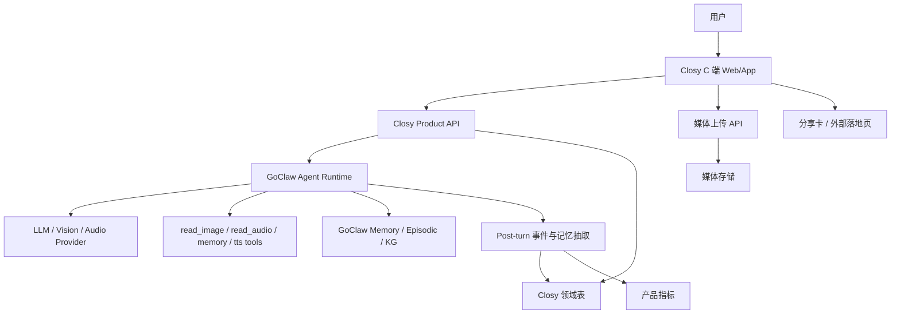
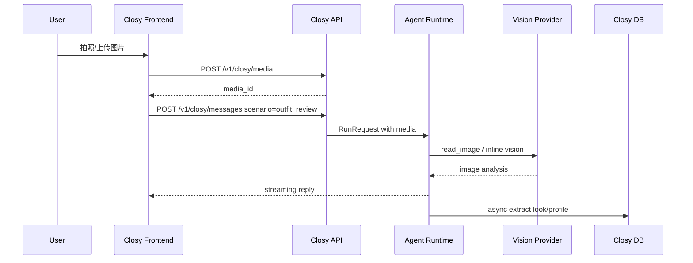
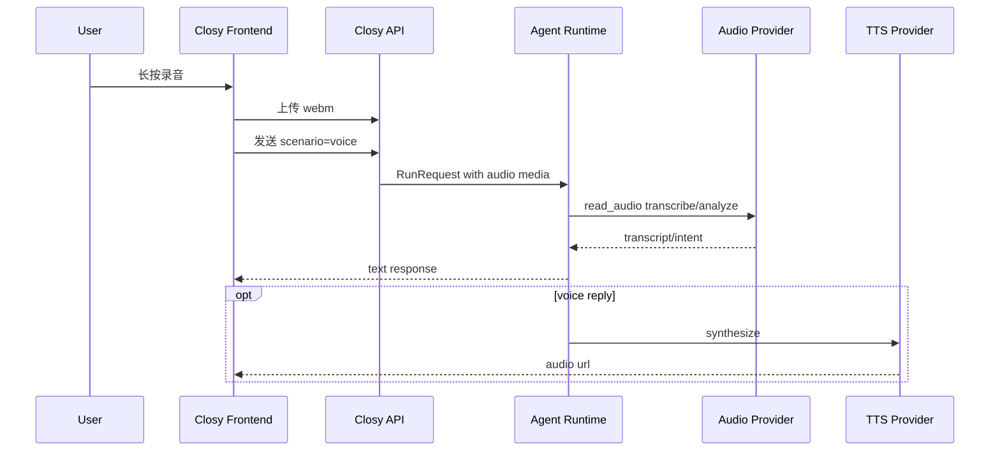

# Closy 实施方案：基于 GoClaw 改造穿搭搭子型单角色 Agent

本文档基于 [Closy PRD](./prd.zh-CN.md) 与当前 GoClaw 技术架构整理，目标是把产品需求转化为可执行的工程实施方案。

结论先行：当前项目不适合直接作为 Closy C 端产品上线，但非常适合作为 Closy 的 Agent Runtime、管理后台和多模态能力底座。推荐采用“GoClaw 内核 + Closy 产品层”的改造方式，而不是重写底层 Agent 系统。

---

## 1. 实施目标

### 1.1 产品目标

实现一个以穿搭、OOTD、自拍、即时拍摄、买前决策为入口，以长期陪伴、记忆、语音关系感为留存核心的单角色 Agent 产品。

MVP 要验证：

1. 用户是否会把 Closy 当作固定对象反复使用。
2. 用户是否会在穿搭任务之外回来聊天。
3. 视觉入口是否显著降低使用门槛。
4. 语音是否提升状态表达、陪伴感和会话轮数。
5. 用户是否愿意分享 Closy 的点评或关系金句。
6. 长期记忆是否带来“她懂我”的感受。

### 1.2 技术目标

在不破坏现有 GoClaw 管理后台和 Agent Runtime 的前提下，新增 Closy 产品层：

- 单角色 Closy 专用体验入口。
- 视觉优先的图片/自拍/相机上传链路。
- 语音输入、音频理解和可选语音回复链路。
- Closy 领域记忆与用户风格画像。
- 分享卡片与外部角色场景落地页。
- 面向产品验证的事件埋点与指标系统。

---

## 2. 范围划分

### 2.1 MVP 范围

MVP 必做：

- Closy 单角色初始化与固定路由。
- C 端聊天主页。
- 图片上传、自拍/拍摄入口、二选一入口。
- 语音录制上传、音频转写/理解。
- 基于图片与语音的 Agent 对话。
- 结构化风格画像和偏好记忆。
- “Closy 记得你”页面。
- 轻量分享卡生成。
- 外部落地页。
- 核心产品事件埋点。

MVP 不做：

- 多角色市场。
- 用户 feed。
- 完整社交关系链。
- 群聊/房间。
- 完整购物闭环。
- 重社区与推荐系统。
- 复杂虚拟人实时语音通话。

### 2.2 后续增强范围

- 更自然的实时语音对话。
- 自动回访和轻主动消息。
- 更细颗粒度的风格知识图谱。
- 多角色扩展。
- 站外增长链路优化。
- 订阅与付费。

---

## 3. 总体架构

### 3.1 推荐架构



### 3.2 分层职责

| 层级 | 职责 | 当前项目复用情况 |
| --- | --- | --- |
| Closy C 端 | 消费级聊天、拍照、自拍、语音、分享、记忆展示 | 需要新增 |
| Closy Product API | 用户态 API、场景入口、领域数据、埋点 | 需要新增 |
| GoClaw Agent Runtime | Agent loop、工具调用、Provider、会话、记忆注入 | 直接复用 |
| 多模态工具层 | 图片理解、音频理解、TTS、媒体存储 | 复用并增强体验 |
| 领域记忆层 | 风格画像、look 记录、偏好、状态线索 | 需要新增 |
| 管理后台 | Agent/Provider/TTS/Memory/Usage 配置 | 复用现有 UI |

---

## 4. 现有能力复用清单

### 4.1 Agent Runtime

当前 GoClaw 已有 Agent Router、Agent Loop、Provider Registry、Tool Registry、Session Store、Memory Store，可作为 Closy 的核心运行时。

复用方式：

- 创建固定 agent key：`closy`。
- 将 Closy 人设、边界、输出结构写入 agent system prompt。
- 所有用户消息进入同一个 Closy agent。
- 使用 `tenant_id + user_id + agent_id` 保证用户隔离。

### 4.2 媒体上传与多模态

当前聊天输入已经支持附件上传和录音上传；后端有 `/v1/media/upload` 和媒体持久化链路。Agent 运行时会把图片、音频、文档等媒体转为 `MediaRef`，并注入工具上下文。

复用方式：

- 图片：复用 `read_image` 工具或 vision-capable main model。
- 音频：复用 `read_audio` 工具进行转写/理解。
- 媒体展示：复用现有 media URL 签名和文件服务机制。

需要增强：

- 前端增加相机/自拍一级入口。
- 图片上传后进入“关系会话”，而不是普通附件展示。
- 为二选一、买前决策、OOTD 点评生成特定 prompt。
- 语音消息需要有更自然的 UI 展示和转写结果。

### 4.3 记忆系统

当前系统已有 memory documents、episodic summaries、knowledge graph、memory auto-inject。

复用方式：

- 长期自由文本记忆继续进入 GoClaw memory。
- 会话摘要继续进入 episodic memory。
- 重要偏好可以同步进入 knowledge graph。

需要增强：

- 新增 Closy 领域结构化记忆表。
- Post-turn 抽取风格偏好、颜色偏好、版型偏好、状态线索、社交呈现偏好。
- “Closy 记得你”页面优先展示结构化领域记忆，而不是通用 memory 文档。

### 4.4 TTS/STT

当前项目已有 TTS 配置与多个 TTS provider，也有音频理解工具。

复用方式：

- 语音输入 MVP 阶段走“录音上传 -> `read_audio` 转写/理解 -> Agent 回复”。
- 语音回复 MVP 阶段走“Agent 文本回复 -> TTS 生成音频 -> 前端播放”。

需要增强：

- 给 Closy 回复增加“自动语音化”开关。
- 给语音用户使用更口语化的回复策略。
- 保存用户偏好的交互方式：文字、语音、自拍。

---

## 5. 数据模型设计

### 5.1 新增表概览

建议新增以下 Closy 领域表：

```text
closy_profiles
closy_style_preferences
closy_looks
closy_decisions
closy_share_cards
closy_events
closy_user_settings
```

### 5.2 closy_profiles

用户级风格画像主表。

字段建议：

| 字段 | 类型 | 说明 |
| --- | --- | --- |
| id | uuid | 主键 |
| tenant_id | uuid | 租户 |
| user_id | text | 用户 ID |
| agent_id | uuid | Closy agent ID |
| style_summary | text | 风格画像摘要 |
| self_expression_summary | text | 自我表达偏好 |
| social_presentation_summary | text | 社交呈现偏好 |
| current_state_summary | text | 最近状态摘要 |
| confidence | numeric | 画像置信度 |
| created_at | timestamptz | 创建时间 |
| updated_at | timestamptz | 更新时间 |

唯一索引：

```sql
UNIQUE (tenant_id, user_id, agent_id)
```

### 5.3 closy_style_preferences

结构化偏好条目。

字段建议：

| 字段 | 类型 | 说明 |
| --- | --- | --- |
| id | uuid | 主键 |
| tenant_id | uuid | 租户 |
| user_id | text | 用户 ID |
| agent_id | uuid | Closy agent ID |
| category | text | 颜色、版型、材质、风格、场景等 |
| polarity | text | like / dislike / neutral |
| value | text | 偏好内容 |
| evidence | text | 来源证据 |
| source_session_key | text | 来源会话 |
| confidence | numeric | 置信度 |
| created_at | timestamptz | 创建时间 |
| updated_at | timestamptz | 更新时间 |

示例：

```json
{
  "category": "color",
  "polarity": "like",
  "value": "低饱和蓝灰色",
  "evidence": "用户多次表示喜欢松弛、干净、不太用力的感觉",
  "confidence": 0.72
}
```

### 5.4 closy_looks

保存用户上传过的 look、自拍、商品图或截图。

字段建议：

| 字段 | 类型 | 说明 |
| --- | --- | --- |
| id | uuid | 主键 |
| tenant_id | uuid | 租户 |
| user_id | text | 用户 ID |
| agent_id | uuid | Closy agent ID |
| session_key | text | 会话 |
| media_id | text | 媒体 ID |
| media_path | text | 文件路径 |
| look_type | text | outfit / selfie / product / story / comparison |
| scene | text | 出门、上班、约会、试衣间等 |
| analysis_summary | text | 视觉分析摘要 |
| closy_judgement | text | Closy 判断 |
| tags | jsonb | 风格标签 |
| created_at | timestamptz | 创建时间 |

### 5.5 closy_decisions

保存明确决策类场景。

字段建议：

| 字段 | 类型 | 说明 |
| --- | --- | --- |
| id | uuid | 主键 |
| tenant_id | uuid | 租户 |
| user_id | text | 用户 ID |
| agent_id | uuid | Closy agent ID |
| session_key | text | 会话 |
| decision_type | text | ootd / compare / purchase / social |
| options | jsonb | 选项信息 |
| choice | text | 选择结果 |
| reason | text | 理由 |
| shareable_quote | text | 适合分享的一句话 |
| created_at | timestamptz | 创建时间 |

### 5.6 closy_share_cards

保存分享卡生成记录。

字段建议：

| 字段 | 类型 | 说明 |
| --- | --- | --- |
| id | uuid | 主键 |
| tenant_id | uuid | 租户 |
| user_id | text | 用户 ID |
| agent_id | uuid | Closy agent ID |
| source_session_key | text | 来源会话 |
| source_message_id | text | 来源消息 |
| card_type | text | outfit_judgement / quote / comparison |
| title | text | 标题 |
| content | text | 卡片内容 |
| media_ids | jsonb | 图片列表 |
| token | text | 外部访问 token |
| expires_at | timestamptz | 过期时间，可空 |
| created_at | timestamptz | 创建时间 |

### 5.7 closy_events

产品事件表，服务 MVP 指标验证。

字段建议：

| 字段 | 类型 | 说明 |
| --- | --- | --- |
| id | uuid | 主键 |
| tenant_id | uuid | 租户 |
| user_id | text | 用户 ID |
| agent_id | uuid | Closy agent ID |
| session_key | text | 会话，可空 |
| event_name | text | 事件名 |
| properties | jsonb | 事件属性 |
| created_at | timestamptz | 创建时间 |

核心事件：

- `closy_opened`
- `closy_message_sent`
- `closy_photo_uploaded`
- `closy_camera_used`
- `closy_selfie_used`
- `closy_voice_recorded`
- `closy_voice_reply_played`
- `closy_decision_requested`
- `closy_share_card_created`
- `closy_share_card_opened`
- `closy_memory_referenced`
- `closy_profile_viewed`
- `closy_returned_7d`

---

## 6. API 设计

### 6.1 Closy 消息发送

```http
POST /v1/closy/messages
```

请求：

```json
{
  "message": "你帮我看这套适不适合今天出门",
  "session_key": "agent:closy:direct:user-a",
  "scenario": "outfit_review",
  "media": [
    {
      "media_id": "m_123",
      "kind": "image"
    }
  ],
  "reply_mode": "text"
}
```

响应：

```json
{
  "run_id": "run_123",
  "session_key": "agent:closy:direct:user-a",
  "status": "started"
}
```

说明：

- 内部仍调用现有 Agent Runtime。
- `scenario` 用于构造 Closy 场景 prompt。
- 支持 SSE 或 WebSocket 复用现有 streaming。

### 6.2 媒体上传

```http
POST /v1/closy/media
```

请求：

```http
Content-Type: multipart/form-data
file=<image/audio/video>
kind=image
source=camera
```

响应：

```json
{
  "media_id": "m_123",
  "kind": "image",
  "mime_type": "image/jpeg",
  "url": "/v1/media/m_123",
  "filename": "selfie.jpg"
}
```

说明：

- 可先复用 `/v1/media/upload`，MVP 后再封装 Closy 专用接口。
- Closy 专用接口更适合记录 `source=camera/selfie/gallery/voice`。

### 6.3 获取 Closy 用户画像

```http
GET /v1/closy/profile
```

响应：

```json
{
  "style_summary": "你整体更适合干净、松弛、不过度用力的表达。",
  "self_expression_summary": "你经常在利落和亲近感之间摇摆。",
  "social_presentation_summary": "你对'显得太刻意'比较敏感。",
  "current_state_summary": "最近你更想要稳住状态，而不是追求惊艳。",
  "preferences": [
    {
      "category": "style",
      "polarity": "like",
      "value": "松弛、干净、利落"
    }
  ],
  "recent_looks": []
}
```

### 6.4 更新/删除记忆

```http
PATCH /v1/closy/profile/preferences/{id}
DELETE /v1/closy/profile/preferences/{id}
```

用途：

- 用户可以纠正 Closy 的记忆。
- 满足 PRD 中“记忆管理”和隐私控制。

### 6.5 创建分享卡

```http
POST /v1/closy/share-cards
```

请求：

```json
{
  "source_session_key": "agent:closy:direct:user-a",
  "source_message_id": "msg_123",
  "card_type": "outfit_judgement",
  "title": "Closy 站这套",
  "content": "它不是最抢眼，但更像你。"
}
```

响应：

```json
{
  "id": "card_123",
  "token": "public_token",
  "share_url": "/s/public_token"
}
```

### 6.6 外部落地页

```http
GET /s/{token}
```

用途：

- 站外用户点击分享卡后进入 Closy 场景落地页。
- 页面展示角色、卡片内容和 CTA：发穿搭图、现在自拍、给我发语音。

---

## 7. 前端实施方案

### 7.1 路由设计

建议新增 C 端路由，不混入现有管理后台主导航：

```text
/closy
/closy/chat/:sessionKey?
/closy/memory
/closy/me
/closy/camera
/closy/share/:token
/s/:token
```

### 7.2 页面清单

#### 页面 1：Closy 聊天主页

职责：

- 作为默认首页。
- 展示角色头像、状态文案、最近上下文卡片。
- 提供 8 个快捷入口：
  - 发穿搭图
  - 现在自拍给你看
  - 帮我选一套
  - 这件值不值得买
  - 我想聊聊
  - 给你发条语音
  - 我今天不知道想成为什么感觉
  - 你觉得我最近适合什么状态

改造点：

- 可复用现有 `ChatThread`、`ChatInput`、WebSocket chat hooks。
- 需要新增 Closy 风格首页壳，不使用现有管理后台布局。
- 快捷入口会自动填充 `scenario` 和 prompt。

#### 页面 2：相机/自拍入口

职责：

- 调用浏览器 `getUserMedia` 或移动端 file capture。
- 支持前后摄像头切换。
- 拍摄后直接进入会话。

MVP 实现路径：

```html
<input type="file" accept="image/*" capture="environment">
<input type="file" accept="image/*" capture="user">
```

后续增强：

- 自定义相机预览。
- 连拍和二选一。
- 图片裁剪与压缩。

#### 页面 3：Closy 记得你

职责：

- 展示风格画像。
- 展示最近聊过的 look。
- 展示已记住偏好。
- 展示最近状态关键词。
- 允许用户删除或纠正记忆。

数据来源：

- `closy_profiles`
- `closy_style_preferences`
- `closy_looks`
- 现有 memory/KG 可作为补充。

#### 页面 4：分享卡片页

职责：

- 从某条 Closy 回复生成分享卡。
- 支持保存图片或复制链接。
- MVP 可以先实现网页卡片 + 浏览器截图/下载。

卡片类型：

- 穿搭点评卡。
- 二选一站队卡。
- 买前决策卡。
- 关系金句卡。

#### 页面 5：外部落地页

职责：

- 站外访问，无需登录即可查看分享卡摘要。
- 强 CTA 引导首次互动。
- 登录或匿名试用后进入 Closy。

注意：

- 不落到用户帖子页。
- 不暴露用户隐私。
- 分享 token 需要可撤销或可过期。

### 7.3 前端组件新增

建议新增：

```text
ui/web/src/pages/closy/
ui/web/src/pages/closy/closy-home-page.tsx
ui/web/src/pages/closy/closy-chat-page.tsx
ui/web/src/pages/closy/closy-camera-page.tsx
ui/web/src/pages/closy/closy-memory-page.tsx
ui/web/src/pages/closy/closy-share-page.tsx
ui/web/src/pages/closy/closy-landing-page.tsx
ui/web/src/pages/closy/hooks/use-closy-chat.ts
ui/web/src/pages/closy/hooks/use-closy-profile.ts
ui/web/src/pages/closy/hooks/use-closy-events.ts
ui/web/src/pages/closy/components/closy-quick-actions.tsx
ui/web/src/pages/closy/components/closy-context-card.tsx
ui/web/src/pages/closy/components/closy-camera-input.tsx
ui/web/src/pages/closy/components/closy-voice-input.tsx
ui/web/src/pages/closy/components/closy-share-card.tsx
```

---

## 8. 后端实施方案

### 8.1 Closy Handler

新增 HTTP handler：

```text
internal/http/closy.go
internal/http/closy_media.go
internal/http/closy_profile.go
internal/http/closy_share.go
internal/http/closy_events.go
```

注册路由：

```go
mux.HandleFunc("POST /v1/closy/messages", h.auth(h.handleSendMessage))
mux.HandleFunc("POST /v1/closy/media", h.auth(h.handleUploadMedia))
mux.HandleFunc("GET /v1/closy/profile", h.auth(h.handleGetProfile))
mux.HandleFunc("PATCH /v1/closy/profile/preferences/{id}", h.auth(h.handleUpdatePreference))
mux.HandleFunc("DELETE /v1/closy/profile/preferences/{id}", h.auth(h.handleDeletePreference))
mux.HandleFunc("POST /v1/closy/share-cards", h.auth(h.handleCreateShareCard))
mux.HandleFunc("GET /v1/closy/share-cards/{id}", h.auth(h.handleGetShareCard))
mux.HandleFunc("POST /v1/closy/events", h.auth(h.handleTrackEvent))
mux.HandleFunc("GET /s/{token}", h.handlePublicShareLanding)
```

### 8.2 Closy Store

新增 store interface：

```go
type ClosyStore interface {
    GetProfile(ctx context.Context, agentID, userID string) (*ClosyProfile, error)
    UpsertProfile(ctx context.Context, profile ClosyProfile) error
    ListPreferences(ctx context.Context, agentID, userID string) ([]ClosyPreference, error)
    UpsertPreference(ctx context.Context, pref ClosyPreference) error
    DeletePreference(ctx context.Context, id string) error
    CreateLook(ctx context.Context, look ClosyLook) error
    ListRecentLooks(ctx context.Context, agentID, userID string, limit int) ([]ClosyLook, error)
    CreateDecision(ctx context.Context, decision ClosyDecision) error
    CreateShareCard(ctx context.Context, card ClosyShareCard) error
    GetShareCardByToken(ctx context.Context, token string) (*ClosyShareCard, error)
    TrackEvent(ctx context.Context, event ClosyEvent) error
}
```

实现：

```text
internal/store/pg/closy.go
internal/store/sqlitestore/closy.go
```

### 8.3 场景 Prompt Builder

新增：

```text
internal/closy/prompt.go
```

职责：

- 根据 `scenario` 构造本轮用户消息增强 prompt。
- 注入用户风格画像摘要。
- 注入最近 look、偏好、状态线索。
- 强制 Closy 保持角色边界。

场景枚举：

```go
const (
    ScenarioOutfitReview = "outfit_review"
    ScenarioSelfieReview = "selfie_review"
    ScenarioCompare      = "compare"
    ScenarioPurchase     = "purchase"
    ScenarioState        = "state"
    ScenarioStyleIdentity = "style_identity"
    ScenarioSocialPresentation = "social_presentation"
    ScenarioCasualChat   = "casual_chat"
    ScenarioVoice        = "voice"
)
```

### 8.4 Post-turn 领域抽取

新增：

```text
internal/closy/extractor.go
internal/closy/post_turn.go
```

每轮 Agent 完成后，异步抽取：

- 风格偏好。
- 不喜欢的风格或单品。
- 社交呈现偏好。
- 状态线索。
- 交互偏好。
- 可分享金句。
- look 结构化摘要。

建议输出 JSON schema：

```json
{
  "profile_patch": {
    "style_summary": "",
    "self_expression_summary": "",
    "social_presentation_summary": "",
    "current_state_summary": ""
  },
  "preferences": [
    {
      "category": "color",
      "polarity": "like",
      "value": "低饱和色",
      "evidence": "用户说不喜欢太用力",
      "confidence": 0.7
    }
  ],
  "look": {
    "look_type": "outfit",
    "scene": "出门前",
    "analysis_summary": "",
    "tags": ["松弛", "利落"]
  },
  "decision": {
    "decision_type": "compare",
    "choice": "left",
    "reason": "",
    "shareable_quote": ""
  }
}
```

MVP 可以先用 LLM extraction；后续再加规则兜底。

### 8.5 Closy Agent 初始化

新增 seed 或 setup：

```text
cmd/setup_closy.go
internal/closy/seed.go
```

创建默认 agent：

```json
{
  "agent_key": "closy",
  "display_name": "Closy",
  "agent_type": "predefined",
  "memory_config": {
    "enabled": true
  },
  "tools_config": {
    "read_image": true,
    "read_audio": true,
    "memory_search": true,
    "tts": true
  }
}
```

System prompt 重点：

- 她是穿搭搭子，不是泛化陪聊。
- 必须围绕穿搭、审美、自我表达、状态、社交呈现。
- 图片点评需要先给结论，再给 1-2 个优先建议。
- 二选一必须明确站队。
- 买前决策要站在用户这边。
- 状态陪伴不鸡汤、不诊断心理疾病。
- 主动引用记忆时要自然克制。
- 可生成适合分享的一句话。

---

## 9. 多模态链路设计

### 9.1 图片/自拍链路



### 9.2 语音链路

MVP：



后续增强：

- WebRTC 实时语音。
- 流式 STT。
- 低延迟 TTS。
- 用户打断和半双工对话。

---

## 10. 指标与埋点

### 10.1 北极星指标

7 日内重复打开并发起对话/上传图片/自拍/语音的用户占比。

### 10.2 核心指标

| 指标 | 事件来源 |
| --- | --- |
| 首次互动转化率 | `closy_opened` -> `closy_message_sent` |
| 图片入口使用率 | `closy_photo_uploaded` / active users |
| 自拍入口使用率 | `closy_selfie_used` / active users |
| 语音入口使用率 | `closy_voice_recorded` / active users |
| 语音后平均轮数 | voice session turn count |
| 7 日复访 | `closy_returned_7d` |
| 分享卡生成率 | `closy_share_card_created` / active users |
| 分享访问转化率 | `closy_share_card_opened` -> signup/chat |
| 记忆引用正反馈 | `closy_memory_referenced` + user feedback |

### 10.3 事件采集策略

- 前端直接采集 UI 行为事件。
- 后端采集 Agent run、media、share、profile 更新事件。
- Post-turn 抽取时记录记忆是否被引用。
- 初期写入 `closy_events` 即可，后续可接入外部分析系统。

---

## 11. 安全与隐私

### 11.1 图片与自拍

要求：

- 所有媒体按 tenant/user 隔离。
- 图片 URL 使用短期签名或鉴权访问。
- 分享卡默认不公开原图，除非用户明确选择。
- 删除 look 时同步删除或失效媒体引用。

### 11.2 语音

要求：

- 录音文件与转写文本均视为敏感数据。
- 用户可删除语音与转写记录。
- 不默认公开语音内容。
- 分享语音转文字金句时需要用户确认。

### 11.3 记忆

要求：

- 用户可查看、删除、纠正记忆。
- 高敏感内容不自动进入风格画像。
- 医疗、心理诊断、危险行为等内容不作为 Closy 专业判断。

### 11.4 外部分享

要求：

- 分享 token 随机、不可枚举。
- 支持过期和撤销。
- 分享页不暴露用户 ID、tenant ID、session key。
- 分享内容只包含用户确认过的卡片内容。

---

## 12. 开发阶段计划

### Phase 0：基础确认与项目切分

目标：

- 固定 Closy agent。
- 确认 vision/audio/TTS provider 可用。
- 确认现有 WebSocket chat 链路可复用。

交付：

- `closy` agent seed。
- 本地可用图片点评 demo。
- 本地可用语音输入 demo。
- 技术 Spike 记录。

验收：

- 上传一张穿搭图，Closy 能基于图片给出点评。
- 上传一段语音，Closy 能理解语音内容并回复。

### Phase 1：C 端聊天主页与视觉入口

目标：

- 实现 Closy 首页。
- 实现相册/拍照/自拍入口。
- 实现场景快捷按钮。

交付：

- `/closy` 页面。
- `/closy/chat/:sessionKey?`。
- `/closy/camera` 或内嵌相机组件。
- `POST /v1/closy/messages` 最小可用。
- `POST /v1/closy/media` 可先包装现有上传接口。

验收：

- 用户可以从首页直接发图。
- 用户可以从首页直接自拍。
- 图片提交后进入会话回复。
- 二选一场景能明确站队。

### Phase 2：领域记忆与“Closy 记得你”

目标：

- 新增 Closy 领域表。
- 实现 post-turn 抽取。
- 实现“Closy 记得你”页面。

交付：

- Closy migration。
- `ClosyStore` PG/SQLite 实现。
- profile/preferences/look/decision 抽取。
- `/closy/memory` 页面。

验收：

- 多轮对话后能形成风格画像。
- 图片点评能沉淀 recent looks。
- 用户可以删除/纠正偏好。
- 下次对话能自然引用用户偏好。

### Phase 3：语音主交互增强

目标：

- 优化语音录制、上传、转写、回复展示。
- 支持可选语音回复。
- 保存用户语音偏好。

交付：

- Closy 语音输入 UI。
- 转写显示或隐藏策略。
- TTS 生成接口接入会话。
- 语音回复播放器。

验收：

- 用户可长按录音发送。
- Closy 能结合语音和图片理解上下文。
- 用户可播放 Closy 语音回复。
- 语音场景回复更口语化。

### Phase 4：分享卡与外部落地页

目标：

- 实现可分享卡片。
- 实现外部落地页。
- 建立拉新链路。

交付：

- `closy_share_cards` 表。
- `POST /v1/closy/share-cards`。
- `/closy/share/:token`。
- `/s/:token`。
- 分享卡图片导出或链接复制。

验收：

- 用户可从回复生成分享卡。
- 外部用户打开分享链接可看到卡片和 Closy CTA。
- 不暴露隐私数据。

### Phase 5：指标闭环与灰度

目标：

- 补齐关键埋点。
- 建立 MVP 指标看板。
- 灰度验证。

交付：

- `closy_events` 表。
- 事件采集 hook。
- 指标查询接口。
- 简版运营/产品看板。

验收：

- 能统计图片入口使用率。
- 能统计语音入口使用率。
- 能统计分享卡生成与访问。
- 能统计 7 日复访。

---

## 13. 验收标准

### 13.1 MVP 功能验收

- 用户打开 `/closy` 后能看到角色化首页。
- 用户能用文字、图片、自拍、语音与 Closy 对话。
- Closy 对穿搭图能给出结构化点评。
- Closy 对二选一能明确站队。
- Closy 对买前决策能给出偏爱式建议。
- Closy 能在非任务场景承接状态，但保持角色边界。
- 用户能看到“Closy 记得你”。
- 用户能生成至少一种分享卡。
- 外部分享链接可访问。

### 13.2 技术验收

- 所有新表具备 PG 和 SQLite migration。
- 所有 Closy API 走现有 auth/tenant/user 上下文。
- 媒体访问不绕过鉴权。
- 用户删除记忆后后续对话不再引用。
- 关键接口有单元测试或 handler 测试。
- 前端核心流程有组件测试或 E2E 冒烟测试。

### 13.3 产品指标验收

- 能追踪打开、发消息、上传图片、自拍、语音、分享卡事件。
- 能按 user/agent/tenant 聚合。
- 能计算 7 日复访。
- 能区分视觉入口和普通文本入口。

---

## 14. 测试计划

### 14.1 后端测试

新增测试：

- Closy profile CRUD。
- Closy preference upsert/delete。
- Closy media upload metadata。
- Share token 生成、访问、撤销。
- Post-turn extraction JSON parse。
- Tenant/user 隔离。
- 删除记忆后检索不到。

### 14.2 前端测试

新增测试：

- 快捷入口生成正确 scenario。
- 图片上传后调用正确 API。
- 语音录制结束后生成音频文件。
- 记忆页展示 profile/preferences。
- 分享卡生成按钮状态。

### 14.3 E2E 冒烟

关键路径：

1. 新用户进入 Closy。
2. 上传穿搭图。
3. 收到点评。
4. 追问二选一。
5. 发送语音。
6. 查看“Closy 记得你”。
7. 生成分享卡。
8. 外部打开分享页。

---

## 15. 主要风险与应对

### 风险 1：底层能多模态，但产品体验仍像附件聊天

应对：

- 相机、自拍、语音必须是首页一级入口。
- 场景按钮必须直接进入关系式会话。
- 图片后回复要短链路、先结论、可追问。

### 风险 2：记忆太通用，无法产生“她懂我”

应对：

- 建立 Closy 领域画像。
- 将通用 memory 作为底层补充，不直接当 C 端展示。
- 每次引用记忆要可解释、可纠正。

### 风险 3：视觉成本高、延迟高

应对：

- 图片压缩。
- read_image provider chain 可配置。
- 对自拍/出门前场景限制输出长度。
- 缓存 look 分析结果。

### 风险 4：语音只是附件，不形成关系感

应对：

- 语音入口前置。
- 保存用户语音偏好。
- 语音用户使用更口语化 prompt。
- 增加可选 TTS 回复。

### 风险 5：分享页泄露隐私

应对：

- 分享前预览确认。
- 默认只分享卡片文案，不分享原图。
- token 不可枚举，可撤销。

---

## 16. 推荐任务拆分

### 后端任务

1. 新增 Closy migration。
2. 新增 ClosyStore interface 与 PG/SQLite 实现。
3. 新增 Closy API handler。
4. 新增 Closy prompt builder。
5. 新增 Closy post-turn extractor。
6. 新增 share token 逻辑。
7. 新增 product event tracking。
8. 增加后端测试。

### 前端任务

1. 新增 Closy 路由组。
2. 新增 Closy 首页。
3. 新增快捷入口组件。
4. 新增相机/自拍组件。
5. 改造聊天发送 hook 支持 Closy scenario。
6. 新增 Closy 记忆页。
7. 新增分享卡组件。
8. 新增外部落地页。
9. 增加前端测试。

### Prompt/产品任务

1. 编写 Closy system prompt。
2. 编写各 scenario prompt。
3. 定义点评输出结构。
4. 定义分享卡文案规则。
5. 定义记忆抽取 JSON schema。
6. 准备灰度测试用例。

---

## 17. 最小可落地路径

如果目标是最快验证 MVP，建议按以下顺序：

1. 创建 `closy` agent。
2. 在现有聊天页基础上新增 `/closy` 轻量壳。
3. 复用 `/v1/media/upload` 和 WebSocket `chat.send`，先跑通图片和语音。
4. 新增 scenario prompt，不急着新增完整 API。
5. 新增 `closy_profiles` 和 `closy_style_preferences` 两张表。
6. 做 post-turn 抽取。
7. 做 `Closy 记得你` 页面。
8. 做分享卡。
9. 再抽象完整 `/v1/closy/*` API。

这条路径可以最大化复用现有系统，降低前期工程量。

---

## 18. 最终判断

当前 GoClaw 具备 Closy 所需的核心底层能力：

- 单角色 Agent。
- 多用户会话。
- 图片理解。
- 音频理解。
- TTS。
- 长期记忆。
- 知识图谱。
- 媒体存储。
- Provider 管理。
- 运行追踪。

但它缺少 Closy 作为 C 端产品所需的领域层和体验层：

- 视觉优先首页。
- 相机/自拍一级入口。
- 语音主交互体验。
- 领域风格画像。
- 分享卡和落地页。
- 产品指标体系。

因此推荐方案是：

> 不重写 GoClaw，不直接套用后台 UI，而是在 GoClaw 之上新增 Closy 产品层。GoClaw 负责 Agent 内核和基础设施，Closy 负责消费级体验、领域记忆、传播和指标闭环。

按本文方案改造后，可以完成 PRD 中的 MVP 需求，并为后续多角色 Agent Native 社交平台保留扩展空间。
